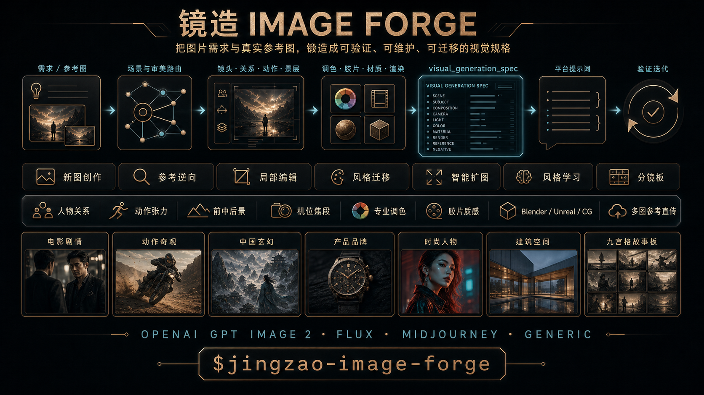

# Jingzao Image Forge — Visual Director, Style Learning, and Structured Image Prompts for Codex

[简体中文](README.zh-CN.md) · [Skill instructions](SKILL.md) · [Visual spec](references/visual-spec.md) · [Prompt compiler](references/prompt-compiler.md)

[](https://github.com/papperrollinggery/jingzao-image-forge/actions/workflows/validate.yml)



Visual suite: [English overview](assets/jingzao-image-forge-hero-en.png) · [feature recommendation poster](assets/jingzao-image-forge-recommendation-zh-v3.png) · [WeChat group card](assets/jingzao-image-forge-wechat-card-zh-v3.png) · [previous card](assets/jingzao-image-forge-group-card-zh-v2.png)

**Jingzao Image Forge (镜造 Image Forge)** is a Codex visual-director Skill for structured image prompt engineering, reference-image style learning, cinematic shot design, art direction, product, fashion, architecture, illustration, animation, documentary, experimental media, spectacle, Chinese-fantasy VFX, and storyboards. It turns briefs, observed references, local edits, learned styles, and multi-frame plans into a maintainable `visual_generation_spec`, then compiles that specification for OpenAI GPT Image 2, FLUX, Midjourney, or a generic image generator.

It is designed for work where composition, named entities, subject relationships, exact text, spatial edits, materials, lighting, style, or preservation constraints must survive multiple prompt iterations.

## Selected Generated Cases

These are actual forward-test outputs generated with the built-in ImageGen and visually inspected on 2026-08-19. They demonstrate different routes and failure controls; they are examples, not deterministic quality guarantees. Comparator and failed-retry images are intentionally excluded.

<table>
  <tr>
    <td width="50%" valign="top"><strong>Narrative film frame</strong><br><br><sub>Relationship staging, eyeline separation, foreground occlusion, restrained practical light, and an incomplete story moment instead of poster posing. <a href="examples/narrative-film-frame.json">Spec</a></sub></td>
    <td width="50%" valign="top"><strong>Causal Chinese-fantasy spectacle</strong><br><br><sub>Scale proven through human/environment ratio, near-frame occlusion, force path, contact, resistance, material fracture, and environmental response. <a href="examples/causal-fantasy-effect.json">Spec</a></sub></td>
  </tr>
  <tr>
    <td width="50%" valign="top"><strong>One-call 3×3 storyboard</strong><br><br><sub>A true nine-cell <code>sheet_direct</code> board with consistent characters, terminal geography, compass state, shot progression, and hand-drawn finish. <a href="examples/styleboard-3x3.json">Spec</a></sub></td>
    <td width="50%" valign="top"><strong>Material-realism portrait</strong><br><br><sub>Natural skin, indigo cloth, worn wood, brushed brass, selective microtexture, clean dark values, and source-motivated highlights without oily gloss or random light spots.</sub></td>
  </tr>
  <tr>
    <td width="50%" valign="top"><strong>Blank-label tactile product</strong><br><br><sub>A targeted no-text retry preserved product geometry, paper tactility, copper response, palette, and depth while removing invented packaging copy. <a href="examples/tactile-stop-motion-product.json">Spec</a></sub></td>
    <td width="50%" valign="top"><strong>Graphite/copper architecture transfer</strong><br><br><sub>A learned capsule transferred from graphic/editorial material into architectural space without copying source subject, text, grid, or layout coordinates. <a href="examples/architecture-exhibition.json">Spec</a></sub></td>
  </tr>
  <tr>
    <td width="50%" valign="top"><strong>Crimson Nocturne — jazz</strong><br><br><sub>Dominant portrait, miniature narrative memory, deep-black field, red/cyan ownership, uneven print texture, and controlled double exposure.</sub></td>
    <td width="50%" valign="top"><strong>Crimson Nocturne — science fiction</strong><br><br><sub>The same capsule survives a different character and world without transferring the source faces, costume, wording, signature, watermark, or exact layout. <a href="references/style-capsules/crimson-nocturne-wuxia-montage.json">Capsule</a></sub></td>
  </tr>
</table>

## Why Jingzao Image Forge?

Image prompts often fail for reasons that are hard to debug: a named character is diluted into generic traits, cinematic language silently changes the rendering medium, an edit drifts outside its target, or platform-specific controls are invented. Jingzao keeps the visual intent separate from provider syntax so the source specification remains inspectable and reusable.

- **Maintain one source of truth:** scene, subjects, camera, lighting, materials, text, edits, invariants, and exclusions.
- **Use model world knowledge deliberately:** optional `knowledge_anchors` preserve exact characters, places, events, artifacts, and fictional-world terms.
- **Control local edits:** normalized points and regions, explicit “change only” instructions, and preserve lists.
- **Control unwanted image artifacts:** compact budgets for noise, bloom, flare, oily or waxy surfaces, sharpening halos, and decorative particles.
- **Route visual intent automatically:** distinguish narrative film frames, key art, posters, grounded cinema, heightened cinema, graphic stylization, giant-scale spectacle, and genre-specific world logic.
- **Route 20+ scenario profiles:** story, portrait, performance, action, campaign, brand, product, fashion, food, architecture, environment, vehicle, creature, history, science, infographic, interface, game, event, social, and experimental work.
- **Select coherent style systems:** cinematic naturalism, noir, expressionism, surreal dream, romantic sublime, modernist graphic, retro analog, luxury editorial, handcrafted, painterly, animation, documentary, speculative, minimal, archival, or mixed media.
- **Learn reusable styles from images:** convert observed reference pixels into source-image-free, testable `style_capsule` files with explicit transfer boundaries and advisory warnings for quoted copy, brand/signature terms, or coordinates.
- **Deliver actual references to ImageGen:** supplied character, wardrobe, product, logo, prop, scene, camera, or style images are emitted as required attachments; prose descriptions cannot silently replace them.
- **Design visual tension and beautiful shots:** control dominant read, action/counterforce, foreground-midground-background roles, exaggeration, lens projection, distortion, parallax, crop pressure, and motion evidence.
- **Build professional color pipelines:** exposure, tone curves, black/white points, highlight rolloff, color separation, skin protection, film grain, halation, bloom, and shot matching.
- **Describe professional CG rendering:** Blender Cycles, Unreal Engine 5/Lumen, path tracing, ray tracing, global illumination, PBR/NPR materials, volumes, sampling, denoise, and visible pass separation inside one generated image.
- **Direct camera and relationships:** bind blocking, eyelines, axis, viewer position, shot size, camera height, camera distance, focal length, focus, and motivated light to one viewer task.
- **Build reference-led styleboards:** role-scoped references, independent frame cards, 3×3 assembly, and line-art, hand-drawn, or cinematic-frame finishes.
- **Compile without fake controls:** optional internal `weight`, `lock`, and `variance` annotations are validated for planning/review but deliberately have no prompt or provider-parameter effect.
- **Improve from real usage:** evidence-backed problems can become optimization proposals, but the Skill changes only after user approval and regression testing.

## Supported Workflows

| Mode | Use it for |
| --- | --- |
| `create` | New images from a brief, from concise single-subject prompts to complex scenes |
| `reconstruct` | Observable style and composition analysis from an actual supplied image |
| `edit` | Minimal local changes with explicit preservation constraints |
| `restyle` | Change visual treatment while locking identity, pose, geometry, layout, and text |
| `expand` | Extend a canvas while preserving subject position, perspective, light, and continuity |
| `learn_style` | Inspect reference images, extract transferable visual rules, and validate a reusable style capsule |
| `styleboard` | Translate identity, wardrobe, scene, camera, and style references into consistent multi-frame boards |

## 30-Second Installation

Clone the repository into your user-level Codex Skills directory:

```bash
git clone https://github.com/papperrollinggery/jingzao-image-forge.git ~/.codex/skills/jingzao-image-forge
```

Start a new Codex task, then invoke the Skill explicitly:

```text
$jingzao-image-forge Create a 21:9 cinematic key visual from this brief.
Return a validated visual_generation_spec and an OpenAI GPT Image 2 prompt.
```

The Skill also allows normal automatic discovery when a request clearly needs structured image prompting.

## Usage Examples

### Create

```text
$jingzao-image-forge Create a clean studio image of one red ceramic cup
on a pale gray background, 1:1, no text. Compile for FLUX.
```

### Knowledge-aware named entity

```text
$jingzao-image-forge Use the exact named character and requested incarnation
as a knowledge anchor. Keep the original animation medium; "cinematic" refers
to framing, scale, and lighting—not live action. Compile for GPT Image 2.
```

### Local edit

```text
$jingzao-image-forge Edit the moon near (x:16.5%, y:16.4%) so it becomes
physically fractured. Change only the moon; preserve the camera, skyline,
exposure, grade, atmosphere, and surrounding sky.
```

### Expand for later cropping

```text
$jingzao-image-forge Expand this landscape image to 21:9. Keep the lighthouse
at the same relative position and scale; add crop-safe space on both sides.
```

### Narrative film frame

```text
$jingzao-image-forge Create one narrative film frame, not key art.
Analyze the relationship change first, then choose blocking, viewer position,
camera height, distance, focal length, focus, and motivated lighting.
```

### Reference-led nine-grid styleboard

```text
$jingzao-image-forge Use these identity, wardrobe, scene, camera, and hand-drawn
style references to build a 3x3 storyboard. Assign each reference one role,
then choose a direct sheet, independent frames, or hybrid from speed and continuity risk.
```

### Learn a reusable style from a reference

```text
$jingzao-image-forge Inspect this actual reference image and create a draft
style capsule. Separate observed traits, inference, and unknowns. Transfer
palette, line, material, light, hierarchy, and rendering rules—but not the
source subject, identity, text, logo, or exact layout. Test it on two new briefs.
```

## How It Works

```text
image brief / observed reference / edit intent
                    ↓
 scenario + genre + aesthetic + medium router
                    ↓
          visual_generation_spec
                    ↓
       deterministic validation + optional style_capsule
                    ↓
  OpenAI · FLUX · Midjourney · generic prompt
```

For simple requests, Jingzao can return a concise prompt. For exact layouts, multi-subject scenes, reference-based work, or edits, it uses the structured specification.

## Actual Multi-Image References Reach the Model

When the user supplies real assets, Jingzao records only the minimal handoff fields: source, role, and whether the image must be attached. The compiler returns an `attachments` manifest and a `reference_handoff` contract. Built-in ImageGen receives local files through `referenced_image_paths` or conversation images through the smallest necessary `num_last_images_to_include`; it must never receive only a textual restatement of an available image.

This applies to character identity, clothing marks, products, packaging, logos, props, locations, compositions, and style references. GPT Image 2 accepts one or more reference images and processes every image input at high fidelity automatically. Logo/product/character fidelity is still visually verified; failures are retried or routed through the model's image-edit workflow. Jingzao does not perform post-generation compositing.

The validator rejects `reconstruct`, `edit`, `restyle`, `expand`, or `learn_style` specifications that lack at least one required attached image. The synthetic atomic edit example therefore contains a runtime asset placeholder that must be replaced with the actual source image before execution.

```bash
python3 scripts/reference_delivery.py path/to/spec.json
```

See [Direct Multi-Image Reference Delivery](references/reference-delivery.md).

## Automatic Visual Direction

Jingzao separates dimensions that are often incorrectly collapsed into “cinematic”:

| Dimension | Values |
| --- | --- |
| Scenario profile | 20+ routes across story, commercial, spatial, knowledge, interface, game, and experimental work |
| Genre family | drama · horror · noir · action · fantasy · science fiction · history · documentary · commercial · surreal · custom |
| Aesthetic family | naturalism · noir · expressionist · oneiric · sublime · modernist · analog · editorial · handcrafted · painterly · animation · documentary · speculative · minimal · archival · mixed |
| Capture/render method | photography · live-action cinema · CG · stylized 3D · 2D · illustration · ink · watercolor · oil · print · collage · stop motion · miniature · paper craft · archive · interface · mixed |
| Scene archetypes | up to three open-text spatial functions, such as intimate interior, public architecture, tabletop, wilderness, stage, lab, underwater, space, or miniature set |
| Style authority | user brief · source reference · learned capsule · source-matched image; explicit tone locks survive scenario changes |
| Spatial dynamics | dominant/secondary read · beauty mechanism · tension · action/counterforce · layer roles · exaggeration · distortion · motion evidence |
| Color pipeline | neutral digital · cinematic · film/print emulation · bleach bypass · B&W · cross-process · archival · custom |
| Render pipeline | offline PBR · real-time · path traced · rasterized · NPR · hybrid layered · custom |
| Deliverable | narrative film frame · cinematic key art · poster · concept art |
| Treatment | grounded cinematic · heightened cinematic · graphic stylized |
| Spectacle scale | intimate · dramatic · monumental · mythic |
| Camera freedom | physical · heightened · impossible |
| Genre logic | user-defined world rule, including Chinese fantasy, xianxia, mythology, giant creatures, science fiction, or documentary realism |

A narrative frame starts from one visible event, relationship pressure, viewer task, and frozen moment. A poster may present assets simultaneously. Monumental and mythic work must prove scale through human/environment comparison, atmosphere, occlusion, parallax, shadow, and environment response. Chinese-fantasy effects require a source, activation protocol, spatial operation, resistance or cost, result, and residue.

## Scenario and Style Atlas

Jingzao does not treat every request as a film poster. The primary scenario determines success: products need silhouette, contact, label, and material proof; fashion needs garment, pose, skin/hair, and styling hierarchy; architecture needs circulation, human scale, daylight, and material junctions; scientific and infographic work needs factual structure, exact labels, and reading order; experimental work needs a declared transformation rule.

The aesthetic is selected independently from genre and medium. Horror may be naturalistic, expressionist, archival, handcrafted, or graphic. Science fiction may be documentary, luxury editorial, ecological, brutal institutional, or playful animation. One primary aesthetic controls global hierarchy; one optional secondary influence controls a named layer through `mix_rule`. See [Scenario Profiles](references/scenario-profiles.md) and the [Visual Style Atlas](references/visual-style-atlas.md).

## Shot Tension, Color, Film, and CG Rendering

For cinematic, battle, performance, fashion-movement, and spectacle work, Jingzao defines what the viewer reads first, where tension comes from, how action and counterforce travel, what each depth layer does, how much exaggeration is allowed, and which anatomy/geometry must remain stable. Camera pitch/yaw/roll, projection, perspective distortion, edge behavior, parallax, crop pressure, and camera state remain coupled to action readability. See [Shot Tension Design](references/shot-tension-design.md).

Professional color is a pipeline rather than a preset name. Jingzao separates technical/display intent, exposure, tone scale, black and white points, highlight rolloff, shadow floor, midtone density, color separation, skin protection, saturation/gamut policy, film negative/print character, grain, halation, bloom, gate weave, vignette, and cross-shot matching. See [Professional Color Pipeline](references/color-pipeline.md).

For CG imagery, engine names are scoped references. “Blender Cycles” can request path-traced material/light behavior; “Unreal Engine 5 Lumen” can request dynamic diffuse interreflection, roughness-aware reflections, sky shadowing, and real-time cinematic constraints. The prompt does not claim those engines actually ran unless an actual pipeline is in scope. See [Render Pipeline Vocabulary](references/render-pipeline.md).

## Cinematic Ultrawide

The general template remains 16:9. Use the optional `cinematic_ultrawide` profile when horizontal space carries story or spectacle information:

```json
{
  "canvas": {
    "profile": "cinematic_ultrawide",
    "aspect_ratio": "21:9",
    "dimensions": {"width": 1792, "height": 768}
  }
}
```

Explicit `2.35:1` and `2.39:1` requests are also supported. The Skill does not force every film image into ultrawide.

## Styleboard and Nine-Grid Mode

`styleboard` supports `line_art`, `hand_drawn`, `cinematic_frame`, and mixed presentation. A reference receives one primary role—identity, wardrobe, scene, prop, `camera_action`, style, layout, or palette—and cannot silently control unrelated layers.

Jingzao supports three execution strategies: `sheet_direct` for fastest one-call ideation, `independent_frames` for strict identity and camera continuity, and `hybrid` for a fast direct sheet followed by targeted high-quality replacement of selected or failed cells. `auto` chooses from speed and continuity risk.

## Learn Style from Reference Images

`learn_style` inspects actual supplied images and records directly observed mechanisms separately from plausible inference and unknown production details. The result can be exported as a reusable `style_capsule` containing medium behavior, palette ownership, line/shape, texture/material, lighting, composition, typography, optics/rendering, transfer rules, and forbidden transfer.

This is not model fine-tuning. The exporter strips input records, stores no raw source pixels, requires explicit forbidden-transfer rules, and warns when visual-rule text appears to contain quoted copy, brand/signature terms, or coordinates. These checks are advisory, so human review still owns identity, protected-character, brand, copy, signature, and layout exclusion. `validated` and `adopted` status require two cross-subject forward tests and visual review notes. Durable installation or public inclusion requires explicit approval.

```bash
python3 scripts/validate_spec.py examples/style-learning-graphite-copper.json
python3 scripts/create_style_capsule.py examples/style-learning-graphite-copper.json \
  --output /tmp/style-capsule-graphite-copper.json
python3 scripts/validate_style_capsule.py /tmp/style-capsule-graphite-copper.json
python3 scripts/compile_prompt.py examples/tactile-stop-motion-product.json \
  --style-capsule /tmp/style-capsule-graphite-copper.json \
  --platform openai
```

## Visual Generation Spec and Optional Knowledge Anchors

The reusable JSON below is the maintainable source of truth compiled for each platform. `knowledge_anchors` are optional and activate only when an exact named entity can contribute useful prior knowledge or reference grounding.

```json
{
  "visual_generation_spec": "1.0",
  "mode": "create",
  "intent": "Create a period-accurate outdoor crowd scene.",
  "platform": "openai",
  "canvas": {"aspect_ratio": "16:9"},
  "inputs": [],
  "knowledge_anchors": [
    {
      "name": "Bethel, New York on August 16, 1969",
      "context": "period-accurate Woodstock-era scene",
      "strategy": "auto",
      "reference_ids": [],
      "verification": "unverified"
    }
  ],
  "constraints": {
    "must_preserve": [],
    "must_change": [],
    "exclude": ["modern objects", "logos", "watermarks"]
  }
}
```

Strategies:

- `auto`: model knowledge without references; hybrid grounding when matching references exist.
- `model_knowledge`: preserve the exact entity early and let a capable model apply existing knowledge.
- `reference`: ground canonical appearance in supplied reference inputs.
- `hybrid`: combine exact named-entity knowledge with version-matched references.

World knowledge improves generation; it is not proof of canonical accuracy. Keep verification `unverified` until checked against a trusted visible reference or confirmed by the user.

## Platform-Aware Compilation

| Target | Compilation behavior |
| --- | --- |
| OpenAI GPT Image 2 | Front-loads knowledge anchors; separates prompt prose from `model`, `quality`, and `size`; preserves edit invariants |
| FLUX.2 | Uses natural language or structured JSON; does not invent an unsupported negative-prompt channel |
| Midjourney | Keeps visible content first and provider parameters at the end; coordinates remain semantic anchors |
| Generic | Produces portable prompt, negative prompt, parameters, and explicit provider warnings |

Compile a validated specification:

```bash
python3 scripts/validate_spec.py examples/atomic-cyber-live-action.json
python3 scripts/validate_spec.py examples/narrative-film-frame.json
python3 scripts/validate_spec.py examples/styleboard-3x3.json
python3 scripts/validate_spec.py examples/style-learning-graphite-copper.json
python3 scripts/validate_style_capsule.py examples/style-capsule-graphite-copper.json
python3 scripts/validate_spec.py examples/causal-fantasy-effect.json
python3 scripts/compile_prompt.py examples/atomic-cyber-live-action.json --platform openai
python3 scripts/compile_prompt.py examples/atomic-cyber-live-action.json --platform flux
python3 scripts/compile_prompt.py examples/atomic-cyber-live-action.json --platform midjourney
python3 scripts/compile_prompt.py examples/atomic-cyber-live-action.json --platform generic
```

The validator and compiler require Python 3.10+ and use only the standard library at runtime.

## Artifact and Surface Quality

Jingzao uses one optional `render.artifact_budget` instead of a long universal cleanup prompt:

| Budget | Best for |
| --- | --- |
| `strict` | Product images, typography, diagrams, minimal editorials, clean gradients |
| `balanced` | Default premium images with restrained scene-motivated effects |
| `expressive` | Painterly, analog, fantasy, or VFX-heavy imagery with intentional artifacts |
| `source_matched` | Edits and expansions that must preserve the source artifact profile |

The quality layer separates material roughness, highlight behavior, texture scale, focal detail, noise/grain, bloom, flare, particles, and sharpness. Intentional film grain, brush texture, wet gloss, and practical-light flare are preserved when requested; unmotivated speckle, global oily sheen, and equal-detail rendering are not treated as “quality.” See [Artifact and Material Quality Controls](references/quality-controls.md).

## Repository Structure

```text
.
├── SKILL.md                     Codex Skill entrypoint
├── agents/openai.yaml           UI metadata and invocation policy
├── templates/                   Visual-spec and style-capsule templates
├── references/                  Scenario, style, shot, color, render, learning, schema, and compiler guidance
├── scripts/                     Spec/capsule validators, attachment preflight, capsule exporter, and prompt compiler
├── examples/                    Validated cinematic, action/VFX, styleboard, style-learning, product, and architecture examples
├── tests/                       Regression tests and behavioral evals
└── assets/                      README visual assets
```

## Validation

```bash
python3 -m py_compile scripts/validate_spec.py scripts/validate_style_capsule.py scripts/create_style_capsule.py scripts/compile_prompt.py tests/test_skill.py
python3 scripts/validate_spec.py templates/visual-spec.json
python3 scripts/validate_spec.py examples/atomic-cyber-live-action.json
python3 -m unittest discover -s tests -v
```

Current local baseline: **111 regression tests** covering all seven modes, seven validated visual-spec examples, two validated/adopted style capsules, creative routing and tone authority, professional color/film finishing, render pipelines, spatial tension, lens distortion, advanced material response, causal VFX, mandatory base-image handoff for reference-led modes, validated Midjourney style references, explicit rejection of post-generation compositing controls, source-image-free capsule export and content-risk warnings, four-platform compilation, malformed-input safety, unknown-field detection, finite numerics, CLI error contracts, styleboards, edits, knowledge anchors, and artifact control.

Manual forward test: a dark environmental portrait combining natural skin, indigo fabric, brushed brass, worn wood, and one practical lamp was generated and visually inspected. Material separation, shadow readability, selective detail, and source-motivated highlights passed; no uncontrolled speckle, floating light orbs, global oily gloss, sharpening halos, or synthetic bokeh were observed. The test image is intentionally not committed to this repository.

Additional direction forward tests passed: a relationship-driven ferry-terminal frame read as a motivated film still rather than a poster; a monumental Chinese-fantasy shot proved scale through architecture, water pressure, occlusion, and one causal formation effect; and a one-call `sheet_direct` 3×3 hand-drawn storyboard produced nine readable 16:9 cells with stable characters, geography, prop state, and reading order. These test images are not committed.

Style-learning forward tests also passed: one learned graphite/copper capsule transferred to a square tactile tea product and a wide architecture pavilion. Both retained palette ownership, material hierarchy, clean shadows, restrained copper accents, and readable negative space while changing subject, ratio, scene, and production method. Neither reproduced the source title, identity, portal image, storyboard grid, or layout coordinates. Test images remain under ignored `output/` and are not committed.

The adopted **Crimson Nocturne Wuxia Print Montage / 绯夜武侠胶片拼贴** capsule was learned from three user-supplied references without storing the raw images. It then passed two unrelated-subject forward tests—a contemporary jazz singer and a desert science-fiction courier—while retaining the crimson/cyan palette ownership, dominant-portrait versus miniature-story hierarchy, controlled double exposure, and uneven analog print behavior without copying source faces, costume, wording, signature, watermark, or exact layout. See [Built-in Style Capsules](references/style-capsules.md). The source images and forward-test outputs are not committed.

The same-model quality benchmark compares a simple brief, a specialist cinematic/product route, and Jingzao on action and product tasks. It records visible strengths, regressions, and the text-invention retry rather than claiming a universal winner. See [Benchmark Results](tests/benchmark-results.md).

## Design Principles and Research References

Jingzao is independently implemented, but its publication and quality methodology were cross-checked against strong primary examples:

- [OpenAI GPT Image Generation Models Prompting Guide](https://developers.openai.com/cookbook/examples/multimodal/image-gen-models-prompting-guide): structured prompts, real materials and skin texture, natural color, limited retouching, world knowledge, and iterative refinement.
- [OpenAI Plugins](https://github.com/openai/plugins): current Codex plugin and Skill packaging structure.
- [Anthropic Skills](https://github.com/anthropics/skills): concise capability definition, self-contained Skill structure, installation, examples, and limitations.
- [GPT-Image2-Skill](https://github.com/wuyoscar/GPT-Image2-Skill): reference-gallery routing, category-specific prompt craft, exact text, and separation of materials, lighting, and palette.
- [Superpowers](https://github.com/obra/superpowers): evidence-first workflows, regression testing, behavioral evaluation, and explicit limitations.
- [ARRI cinematography case studies](https://www.arri.com/news-en/alexa-lf-signature-primes-and-skypanels-on-the-film-rrr): focal lengths, movement, scale, and camera choices tied to shot requirements rather than generic style tokens.
- [Pixar RenderMan cinematography research](https://renderman.pixar.com/stories/incredible-cinematography): camera/staging and lighting systems change with character, sequence intensity, and viewer focus while preserving a common visual language.
- [Cinematic Storyboard Generator](https://github.com/NBchitu/cinematic-storyboard-generator): public 3×3 storyboard packaging, style bibles, per-panel camera intent, and provider-ready prompts; Jingzao keeps one-call boards as the speed path and independent frames as the precision path.
- [OpenAI Academy — Creating images with ChatGPT](https://openai.com/academy/image-generation/): purpose-first prompts, explicit invariants, small targeted revisions, reference-role labeling, text guidance, and dense-layout considerations.
- [Midjourney Style Reference](https://docs.midjourney.com/hc/en-us/articles/32180011136653-Style-Reference): current `--sref`, global `--sw`, and positive relative `URL::weight` behavior for multiple style references.
- [OpenAI Image Generation Guide](https://developers.openai.com/api/docs/guides/image-generation): one or more image references, high-fidelity GPT Image 2 inputs, edit workflows, flexible sizes, and model limitations.
- [Unreal Engine — What is virtual production?](https://www.unrealengine.com/explainers/virtual-production/what-is-virtual-production): previs, pitchvis, techvis, stuntvis, virtual scouting, live compositing, and in-camera VFX as distinct visualization scenarios.
- [Pixar RenderMan — Cinematography with Soul](https://renderman.pixar.com/stories/cinematography-with-soul): tactile-world look development, real-world light behavior, prelighting, and rough-to-fine collaboration.
- [SideFX — World Building](https://www.sidefx.com/products/houdini/world-building/): art-directable terrain, foliage, cloud, ocean, simulation, and procedural environment systems.
- [National Film Board of Canada — Stop-Motion](https://blog.nfb.ca/blog/2018/08/13/animation-stop-motion/): object-by-object frame capture, clay/pixilation/hybrid techniques, and physical animation craft.
- [GPT-Image2-Skill Gallery Atlas](https://github.com/wuyoscar/GPT-Image2-Skill/blob/main/skills/gpt-image/references/gallery.md): category-indexed progressive disclosure across photography, product, food, fashion, architecture, science, UI, illustration, film, typography, and editing.
- [ARRI Image Science and Look Files](https://www.arri.com/en/learn-help/learn-help-camera-system/image-science/look-files): log capture, technical display conversion, creative look management, exposure latitude, and film-like highlight handling.
- [ACES Output Transforms](https://docs.acescentral.com/system-components/output-transforms/): scene-referred color, rendering transforms, gamut/tone mapping, display encoding, and output-viewing conditions.
- [DaVinci Resolve Film Look Creator](https://documents.blackmagicdesign.com/SupportNotes/DaVinci_Resolve_19_1_New_Features_Guide.pdf): separate controls for halation amount, radius, saturation, highlight threshold, and other film finishing behavior.
- [Blender Cycles and Principled BSDF](https://docs.blender.org/manual/en/4.0/render/shader_nodes/shader/principled.html): physically based materials with metal, diffuse, subsurface, transmission, coat, sheen, emission, roughness, and IOR behavior.
- [Unreal Engine 5 Lumen](https://dev.epicgames.com/documentation/en-us/unreal-engine/lumen-global-illumination-and-reflections-in-unreal-engine): dynamic diffuse interreflection, indirect specular, sky shadowing, emissive bounce, translucency, and roughness-aware reflections.

The resulting method is intentionally compact: exact intent first, optional structured controls only when they add value, deterministic validation, one artifact budget, targeted iteration, and visual verification before quality claims.

## Boundaries

- This Skill prepares specifications and prompts; it does not generate images by itself. Pair it with Codex `$imagegen` or another image-generation system for execution.
- A coordinate is a semantic anchor, not a pixel-accurate mask.
- Reconstruction describes observable visual attributes; it cannot recover an unknowable original prompt.
- Style learning extracts observable visual mechanisms; it is not weight training, hidden-prompt recovery, or permission to publish a private reference.
- A learned capsule remains subordinate to the target brief and requires visual transfer tests before validation or adoption.
- Required reference images must be present in the actual generation/edit call; a compiled prompt description is not proof of attachment.
- Reference-driven generation remains generative and must be visually verified. This Skill does not introduce a post-generation compositing stage.
- Engine names are appearance references unless an actual renderer workflow is explicitly in scope; compiled prompts do not prove software execution.
- Film emulation and professional grading remain visual intent; generated outputs still require calibrated visual review.
- Provider behavior changes. Recheck current official documentation before changing models, parameters, limits, or capability claims.
- A successful compile does not prove visual quality, identity accuracy, or provider compliance. Inspect generated outputs.

## FAQ

### What is Jingzao Image Forge?

It is a Codex Skill that converts image-generation intent into a structured visual specification and platform-ready prompts.

### Why use a visual specification instead of one long prompt?

The specification separates stable facts and invariants from creative variation. It makes scene relationships, exact text, edits, and provider differences easier to inspect, test, and revise.

### Does it support GPT Image 2 world knowledge?

Yes. Exact named entities can be preserved as optional knowledge anchors and placed early in OpenAI prompts. Accuracy still requires visual verification.

### Can it edit a precise region?

It can describe points and approximate regions. Pixel-accurate editing still requires an actual mask or editor-region capability.

### Is it tied to one image model?

No. The source specification is provider-neutral and currently compiles for OpenAI, FLUX, Midjourney, and generic targets.

### How does it prevent film frames from looking like posters?

Narrative profiles require a visible event, relationship pressure, viewer task, frozen moment, staging, camera motivation, lens rationale, and motivated lighting. They explicitly guard against simultaneous asset showcase and equal-detail rendering.

### Does it support nine-grid storyboards?

Yes. `styleboard` supports 3×3 boards, role-scoped references, continuity locks, one-call direct sheets, independent native-ratio frames, hybrid replacement, and line-art, hand-drawn, cinematic-frame, or mixed finishes.

### Can it learn a style from my reference image?

Yes. `learn_style` inspects the actual image, separates observation from inference, exports a source-image-free style capsule, warns about obvious content-copy risks, and tests it on different content. Transfer boundaries are enforced through reviewed rules and validation—not by claiming perfect automated recognition of every identity, brand, or protected element.

### Does ImageGen receive my actual product, logo, or character images?

Yes, when they are supplied and marked `must_attach`. The compiler emits the attachment manifest, and the execution workflow passes the actual images to ImageGen rather than translating them into text only. The output is then visually checked for identity, marks, packaging, logo shape, placement, spelling, and color; failures are retried within generation/editing, not hidden by compositing.

### What kinds of images can it direct?

Beyond cinema and fantasy, it supports portraits, relationship/performance frames, action, campaigns, brand systems, products, fashion, beauty, food, architecture, environments, vehicles, creatures, historical/documentary scenes, science and education, infographics, interfaces, game assets, events, social content, and experimental art.

### Can it create Blender or Unreal Engine style renders?

It can encode visible material, light-transport, GI, reflection, volume, sampling, and pass-separation behavior associated with Blender Cycles, Eevee, Unreal Engine 5/Lumen, and other production renderers. This is a single-generation appearance specification unless the user is running an actual renderer pipeline; it never adds a post-generation compositing route.

### Does it support professional film color and grain?

Yes. `color_pipeline` controls exposure, tonal density, highlight rolloff, color separation, skin protection, display intent, film negative/print character, grain, halation, bloom, gate weave, vignette, and shot matching. Intentional film texture remains separate from unwanted AI noise or oily artifacts.

## Project Status

The Skill is actively developed from observed failures and regression-tested before its installed copy is synchronized. Focused issues are welcome; redistribution and contribution terms remain undecided until the maintainer selects a license.

This is an independent community project and is not affiliated with OpenAI, Black Forest Labs, Midjourney, Anthropic, or their products.
