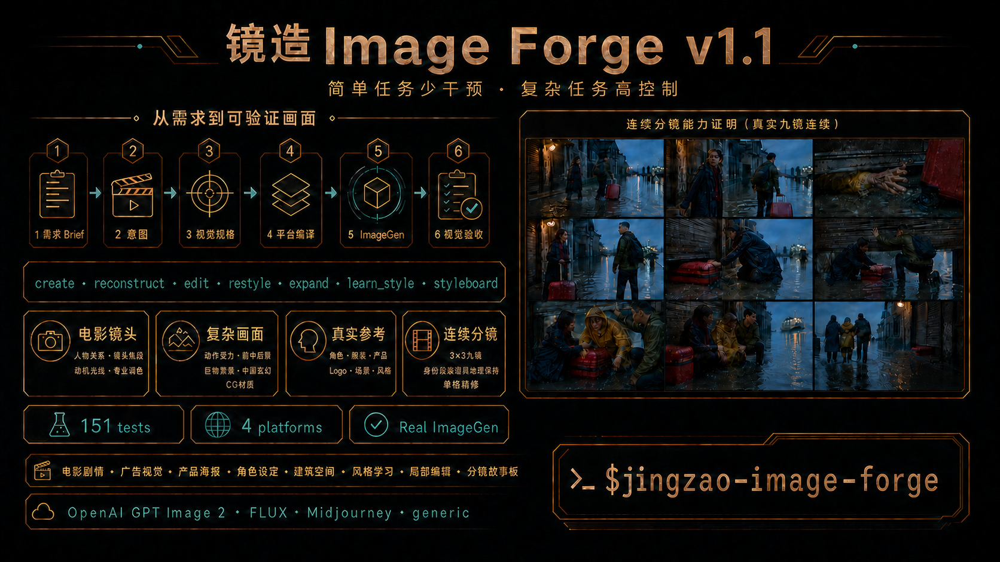
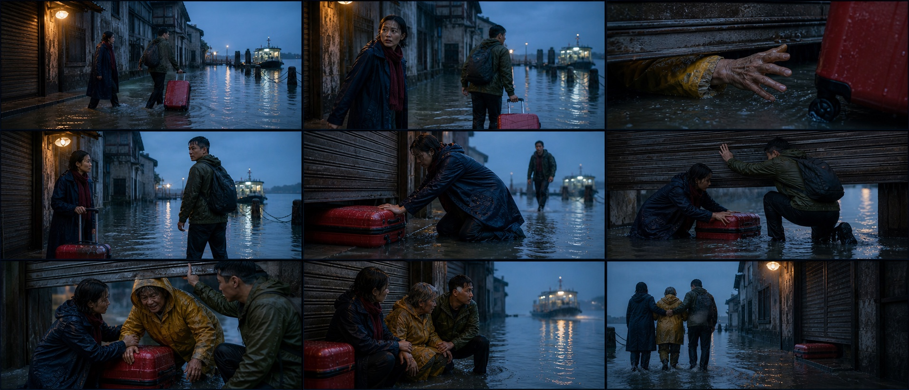

# Jingzao Image Forge — Visual Director, Style Learning, and Structured Image Prompts for Codex

[简体中文](README.zh-CN.md) · [Skill instructions](SKILL.md) · [Visual spec](references/visual-spec.md) · [Prompt compiler](references/prompt-compiler.md)

[](https://github.com/papperrollinggery/jingzao-image-forge/actions/workflows/validate.yml)



<sub>Evidence note: the embedded “Real ImageGen” label summarizes the workflow. The nine-shot board shown in this image is a manual visual-review case, not a public execution receipt; see the case label below and the [forward-test manifest](tests/forward-test-manifest.json) for the auditable boundary.</sub>

Visual suite: [English overview](assets/jingzao-image-forge-hero-en.png) · [previous workflow page](assets/jingzao-image-forge-intro-zh-v4.png) · [feature recommendation poster](assets/jingzao-image-forge-recommendation-zh-v3.png) · [WeChat group card](assets/jingzao-image-forge-wechat-card-zh-v3.png)

Featured specs and evidence: [continuous nine-shot film spec](examples/continuous-nine-shot-ferry.json) · [UI Motion validated spec](examples/ui-motion-storyboard.json) · [bridge-rescue spec](tests/forward-specs/cinematic-bridge-rescue.json) · [path-traced koi spec](tests/forward-specs/path-traced-koi-automaton.json) · [Chinese-fantasy spec](examples/causal-fantasy-effect.json) · [Crimson Nocturne capsule](references/style-capsules/crimson-nocturne-wuxia-montage.json)

**Jingzao Image Forge (镜造 Image Forge)** is a Codex visual-director Skill for structured AI image prompts, clean GPT Image 2 rendering, cinematic film frames, continuous and UI Motion storyboards, character and prop consistency, real multi-image references, reference-image style learning, art direction, product, fashion, architecture, illustration, animation, documentary, spectacle, Chinese-fantasy VFX, and CG material studies. It turns briefs, observed references, local edits, learned styles, interface-state sequences, and multi-shot plans into a maintainable `visual_generation_spec`, then compiles that specification for OpenAI GPT Image 2, FLUX, Midjourney, or a generic image generator. Its default preventive clean base lowers the chance of unowned speckle, texture noise, dirty AO, global oily/plastic response, and equal-detail rendering while preserving intentional film grain, brush texture, patina, wet materials, wear, and practical-light artifacts.

Simple tasks stay concise; complex tasks receive a larger dynamic semantic review target based on the actual sections, subjects, references, materials, effects, text, constraints, and frames they contain. The compiler never treats this target as a model limit and never truncates explicit content.

## Selected Gallery Cases

This gallery contains 15 outputs visually inspected on 2026-08-19–20. Twelve are hash/receipt-bound in the forward-test manifest. The hand-drawn storyboard, material-realism portrait, and continuous nine-shot film board are labeled manual visual review because a public execution receipt or original prompt record was not retained; those three cases do not independently prove the generator, tool-call linkage, or input handoff. They demonstrate different routes and failure controls; they are examples, not deterministic quality guarantees. Comparator and failed-retry images are intentionally excluded.

<table>
  <tr>
    <td colspan="2" valign="top"><strong>Continuous nine-shot film story — manual visual review</strong><br><br><sub>The committed spec, master reference, and 3×3 gallery output are available for inspection. Manual visual review found stable sibling identity, wardrobe, backpack, red-suitcase state, pharmacy/ferry geography, predawn blue-and-amber light, and a complete causal arc across nine different shot designs, with the frame-6 hand-load deviation disclosed below. No public execution receipt was retained, so this case does not prove tool-call linkage or actual reference delivery. <a href="examples/continuous-nine-shot-ferry.json">Spec</a></sub></td>
  </tr>
  <tr>
    <td width="50%" valign="top"><strong>Ultrawide bridge rescue</strong><br><br><sub>One readable wrist grip, planted counterforce, incomplete action, foreground occlusion, broken-bridge geography, cloud-depth scale, and motivated lantern light. <a href="tests/forward-specs/cinematic-bridge-rescue.json">Spec</a></sub></td>
    <td width="50%" valign="top"><strong>Path-traced koi automaton</strong><br><br><sub>Porcelain, brass, glass, and water remain optically distinct through controlled roughness, reflection, refraction, contact, negative space, and clean path-traced gradients. <a href="tests/forward-specs/path-traced-koi-automaton.json">Spec</a></sub></td>
  </tr>
  <tr>
    <td width="50%" valign="top"><strong>Crimson Nocturne — jazz</strong><br><br><sub>Dominant portrait, miniature narrative memory, deep-black field, red/cyan ownership, uneven print texture, and controlled double exposure.</sub></td>
    <td width="50%" valign="top"><strong>Causal Chinese-fantasy spectacle</strong><br><br><sub>Scale proven through human/environment ratio, near-frame occlusion, force path, contact, resistance, material fracture, and environmental response. <a href="examples/causal-fantasy-effect.json">Spec</a></sub></td>
  </tr>
  <tr>
    <td width="50%" valign="top"><strong>3×3 hand-drawn storyboard — manual visual review</strong><br><br><sub>Manual visual review: nine readable cells, stable geography and hand-drawn finish; the original reference-delivery receipt was not retained, so this is not manifest-bound execution evidence. <a href="examples/styleboard-3x3.json">Spec</a></sub></td>
    <td width="50%" valign="top"><strong>Dynamic CG-fashion frame</strong><br><br><sub>Action phase, cloth drag, wet roughness, train motion axis, contact, depth layers, and motivated light read clearly without claiming that Unreal, Blender, or Lumen actually ran. <a href="tests/forward-specs/cg-fashion-rain-platform.json">Spec</a></sub></td>
  </tr>
  <tr>
    <td width="50%" valign="top"><strong>Narrative film frame</strong><br><br><sub>Relationship staging, eyeline separation, foreground occlusion, restrained practical light, and an incomplete story moment instead of poster posing. <a href="examples/narrative-film-frame.json">Spec</a></sub></td>
    <td width="50%" valign="top"><strong>Crimson Nocturne — science fiction</strong><br><br><sub>The same capsule survives a different character and world without transferring the source faces, costume, wording, signature, watermark, or exact layout. <a href="references/style-capsules/crimson-nocturne-wuxia-montage.json">Capsule</a></sub></td>
  </tr>
  <tr>
    <td width="50%" valign="top"><strong>Graphite/copper product transfer</strong><br><br><sub>The same evidence-bound capsule works on a compact product image while preserving a blank label, clean silhouette, matte paper, and selective copper response.</sub></td>
    <td width="50%" valign="top"><strong>Source-preserving risograph restyle</strong><br><br><sub>The actual source image reached ImageGen; person, motorcycle, camera, 4:3 crop, and station geometry stayed aligned while only the medium changed. <a href="tests/forward-specs/restyle-risograph-service-station.json">Spec</a></sub></td>
  </tr>
  <tr>
    <td width="50%" valign="top"><strong>Blank-label tactile product</strong><br><br><sub>A targeted no-text retry preserved product geometry, paper tactility, copper response, palette, and depth while removing invented packaging copy. <a href="examples/tactile-stop-motion-product.json">Spec</a></sub></td>
    <td width="50%" valign="top"><strong>Graphite/copper architecture transfer</strong><br><br><sub>A learned capsule transferred from graphic/editorial material into architectural space without copying source subject, text, grid, or layout coordinates. <a href="examples/architecture-exhibition.json">Spec</a></sub></td>
  </tr>
  <tr>
    <td width="50%" valign="top"><strong>Material-realism portrait</strong><br><br><sub>Manual visual review only: natural skin, indigo cloth, worn wood, brushed brass, selective microtexture, and clean dark values; the original prompt record was not retained, so this is not manifest-bound evidence.</sub></td>
    <td width="50%" valign="top"><strong>Scientific reference reconstruction</strong><br><br><sub>Observed geometry, counts, materials, camera, and light were separated from inference and unknowns; the actual source and receipt are evidence-bound. <a href="tests/forward-specs/reconstruct-microfluidic-chip.json">Spec</a></sub></td>
  </tr>
</table>

## Why Jingzao Image Forge?

Image prompts often fail for reasons that are hard to debug: a named character is diluted into generic traits, cinematic language silently changes the rendering medium, an edit drifts outside its target, or platform-specific controls are invented. Jingzao keeps the visual intent separate from provider syntax so the source specification remains inspectable and reusable.

- **Maintain one source of truth:** scene, subjects, camera, lighting, materials, text, edits, invariants, and exclusions.
- **Scale intervention to the task:** an empty template emits nothing; a real first-pass prompt receives only a medium-preserving clean base and no invented ratio, camera, grain, bloom, flare, particles, color pipeline, or render pipeline.
- **Use model world knowledge deliberately:** optional `knowledge_anchors` preserve exact characters, places, events, artifacts, and fictional-world terms.
- **Control local edits:** normalized points and regions, explicit “change only” instructions, and preserve lists.
- **Prevent and control unwanted image artifacts:** the default clean base lowers risk before generation; explicit budgets and a fail-closed surface gate handle noise, random speckles, oily or waxy surfaces, dirty AO, plastic reflections, sharpening halos, and equal-frequency texture.
- **Budget prompts by semantic complexity:** `concise`, `standard`, `complex`, and `sequence` prompts receive different review targets; repeated prose cannot manufacture more budget, and no field is auto-truncated.
- **Route visual intent automatically:** distinguish narrative film frames, key art, posters, grounded cinema, heightened cinema, graphic stylization, giant-scale spectacle, and genre-specific world logic.
- **Route 20+ scenario profiles:** story, portrait, performance, action, campaign, brand, product, fashion, food, architecture, environment, vehicle, creature, history, science, infographic, interface, game, event, social, and experimental work.
- **Select coherent style systems:** cinematic naturalism, noir, expressionism, surreal dream, romantic sublime, modernist graphic, retro analog, luxury editorial, handcrafted, painterly, animation, documentary, speculative, minimal, archival, or mixed media.
- **Learn reusable styles from images:** convert observed reference pixels into source-image-free, testable `style_capsule` files with explicit transfer boundaries and advisory warnings for quoted copy, brand/signature terms, or coordinates.
- **Verify actual reference delivery:** supplied character, wardrobe, product, logo, prop, scene, camera, or style images produce a target-aware ImageGen call plan; reference-backed execution requires a matching sent-input receipt, so prose descriptions cannot silently replace them.
- **Separate plumbing from creative quality:** attachment success never substitutes for purpose, product use, interaction physics, anatomy, body balance, or a clear viewer conclusion.
- **Clean prompts without flattening style:** source tracing and a semantic ledger remove old-failure residue, negative association leakage, repeated mechanisms, and conflicting anchors while protecting medium, aesthetic, palette, material, camera, and intentional exaggeration.
- **Design visual tension and beautiful shots:** control dominant read, action/counterforce, foreground-midground-background roles, exaggeration, lens projection, distortion, parallax, crop pressure, and motion evidence.
- **Build professional color pipelines:** exposure, tone curves, black/white points, highlight rolloff, color separation, skin protection, film grain, halation, bloom, and shot matching.
- **Describe professional CG rendering:** Blender Cycles, Unreal Engine 5/Lumen, path tracing, ray tracing, global illumination, PBR/NPR materials, volumes, sampling, denoise, and visible pass separation inside one generated image.
- **Direct camera and relationships:** bind blocking, eyelines, axis, viewer position, shot size, camera height, camera distance, focal length, focus, and motivated light to one viewer task.
- **Maintain causal continuity across shots:** lock identity, wardrobe, props, geography, light direction, screen direction, and object state while each frame advances one new story beat.
- **Build cinematic and UI Motion styleboards:** role-scoped references, independent frame cards, 3×3 assembly, exact in-frame typography, local interface states, semantic accent ownership, explicit L0–L3 hierarchy, and line-art, hand-drawn, or cinematic-frame finishes.
- **Compile without fake controls:** legacy `weight`, `lock`, and `variance` annotations remain accepted for compatibility but are deprecated, omitted from new examples, ignored by compilation, and never mapped to provider controls.
- **Improve from real usage:** evidence-backed problems can become optimization proposals, but the Skill changes only after user approval and regression testing.

## Supported Workflows

| Mode | Use it for |
| --- | --- |
| `create` | New images from a brief, from concise single-subject prompts to complex scenes |
| `reconstruct` | Observable style and composition analysis from an actual supplied image |
| `edit` | Minimal local changes with explicit preservation constraints |
| `restyle` | Change visual treatment while locking identity, pose, geometry, layout, and text |
| `expand` | Extend a canvas under a preservation contract; strict position/scale/ratio retention remains visually verified and may fail in extreme outpainting |
| `learn_style` | Inspect reference images, extract transferable visual rules, and validate a reusable style capsule |
| `styleboard` | Build cinematic or UI Motion boards from identity, scene, camera, style, exact text, interface state, and semantic accent decisions |

## 30-Second Installation

Clone the repository into your user-level Codex Skills directory:

```bash
git clone https://github.com/papperrollinggery/jingzao-image-forge.git ~/.codex/skills/jingzao-image-forge
```

Start a new Codex task, then invoke the Skill explicitly:

```text
$jingzao-image-forge Create a 21:9 cinematic key visual from this brief.
Return a validated visual_generation_spec and an OpenAI GPT Image 2 prompt.
```

The Skill also allows normal automatic discovery when a request clearly needs structured image prompting.

## Usage Examples

### Create

```text
$jingzao-image-forge Create a clean studio image of one red ceramic cup
on a pale gray background, 1:1, no text. Compile for FLUX.
```

### Knowledge-aware named entity

```text
$jingzao-image-forge Use the exact named character and requested incarnation
as a knowledge anchor. Keep the original animation medium; "cinematic" refers
to framing, scale, and lighting—not live action. Compile for GPT Image 2.
```

### Local edit

```text
$jingzao-image-forge Edit the moon near (x:16.5%, y:16.4%) so it becomes
physically fractured. Change only the moon; preserve the camera, skyline,
exposure, grade, atmosphere, and surrounding sky.
```

### Expand for later cropping

```text
$jingzao-image-forge Expand this landscape image to 21:9. Keep the lighthouse
at the same relative position and scale; add crop-safe space on both sides.
```

### Narrative film frame

```text
$jingzao-image-forge Create one narrative film frame, not key art.
Analyze the relationship change first, then choose blocking, viewer position,
camera height, distance, focal length, focus, and motivated lighting.
```

### Reference-led nine-grid styleboard

```text
$jingzao-image-forge Use these identity, wardrobe, scene, camera, and hand-drawn
style references to build a 3x3 storyboard. Assign each reference one role,
then choose a direct sheet, independent frames, or hybrid from speed and continuity risk.
```

### Learn a reusable style from a reference

```text
$jingzao-image-forge Inspect this actual reference image and create a draft
style capsule. Separate observed traits, inference, and unknowns. Transfer
palette, line, material, light, hierarchy, and rendering rules—but not the
source subject, identity, text, logo, or exact layout. Test it on two new briefs.
```

## How It Works

```text
image brief / observed reference / edit intent
                    ↓
 scenario + genre + aesthetic + medium router
                    ↓
          visual_generation_spec
                    ↓
       deterministic validation + optional style_capsule
                    ↓
  OpenAI · FLUX · Midjourney · generic prompt
```

For simple requests, Jingzao can return a concise prompt. For exact layouts, multi-subject scenes, reference-based work, or edits, it uses the structured specification.

## Actual Multi-Image References Reach the Model

When the user supplies real assets, Jingzao records only source, role, and `must_attach`. The compiler returns `attachments`, `reference_handoff`, and a target-aware `imagegen_call_plan`. Built-in ImageGen is fail-closed above five required images, on mixed local/conversation mechanisms, unresolved remote/platform assets, or an unconfirmed recent conversation-image window. After the tool call, a receipt must match expected input IDs/count/mechanism before the result is called reference-backed.

This applies to character identity, clothing marks, products, packaging, logos, props, locations, compositions, and style references. GPT Image 2 accepts one or more reference images and processes every image input at high fidelity automatically. Logo/product/character fidelity is still visually verified; failures are retried or routed through the model's image-edit workflow. Jingzao does not perform post-generation compositing.

The validator rejects `reconstruct`, `edit`, `restyle`, `expand`, or `learn_style` specifications that lack at least one required attached image. The synthetic atomic edit example therefore contains a runtime asset placeholder that must be replaced with the actual source image before execution.

```bash
python3 scripts/reference_delivery.py path/to/spec.json --target codex_imagegen
python3 scripts/reference_delivery.py path/to/spec.json --target codex_imagegen --receipt path/to/receipt.json
```

See [Direct Multi-Image Reference Delivery](references/reference-delivery.md).

## Automatic Visual Direction

Jingzao separates dimensions that are often incorrectly collapsed into “cinematic”:

| Dimension | Values |
| --- | --- |
| Scenario profile | 20+ routes across story, commercial, spatial, knowledge, interface, game, and experimental work |
| Genre family | drama · horror · noir · action · fantasy · science fiction · history · documentary · commercial · surreal · custom |
| Aesthetic family | naturalism · noir · expressionist · oneiric · sublime · modernist · analog · editorial · handcrafted · painterly · animation · documentary · speculative · minimal · archival · mixed |
| Capture/render method | photography · live-action cinema · CG · stylized 3D · 2D · illustration · ink · watercolor · oil · print · collage · stop motion · miniature · paper craft · archive · interface · mixed |
| Scene archetypes | up to three open-text spatial functions, such as intimate interior, public architecture, tabletop, wilderness, stage, lab, underwater, space, or miniature set |
| Style authority | user brief · source reference · learned capsule · source-matched image; explicit tone locks survive scenario changes |
| Spatial dynamics | dominant/secondary read · beauty mechanism · tension · action/counterforce · layer roles · exaggeration · distortion · motion evidence |
| Color pipeline | neutral digital · cinematic · film/print emulation · bleach bypass · B&W · cross-process · archival · custom |
| Render pipeline | offline PBR · real-time · path traced · rasterized · NPR · hybrid layered · custom |
| Deliverable | narrative film frame · cinematic key art · poster · concept art |
| Treatment | grounded cinematic · heightened cinematic · graphic stylized |
| Spectacle scale | intimate · dramatic · monumental · mythic |
| Camera freedom | physical · heightened · impossible |
| Genre logic | user-defined world rule, including Chinese fantasy, xianxia, mythology, giant creatures, science fiction, or documentary realism |

A narrative frame starts from one visible event, relationship pressure, viewer task, and frozen moment. A poster may present assets simultaneously. Monumental and mythic work must prove scale through human/environment comparison, atmosphere, occlusion, parallax, shadow, and environment response. Chinese-fantasy effects require a source, activation protocol, spatial operation, resistance or cost, result, and residue.

## Scenario and Style Atlas

Jingzao does not treat every request as a film poster. The primary scenario determines success: products need silhouette, contact, label, and material proof; fashion needs garment, pose, skin/hair, and styling hierarchy; architecture needs circulation, human scale, daylight, and material junctions; scientific and infographic work needs factual structure, exact labels, and reading order; experimental work needs a declared transformation rule.

The aesthetic is selected independently from genre and medium. Horror may be naturalistic, expressionist, archival, handcrafted, or graphic. Science fiction may be documentary, luxury editorial, ecological, brutal institutional, or playful animation. One primary aesthetic controls global hierarchy; one optional secondary influence controls a named layer through `mix_rule`. See [Scenario Profiles](references/scenario-profiles.md) and the [Visual Style Atlas](references/visual-style-atlas.md).

## Shot Tension, Color, Film, and CG Rendering

For cinematic, battle, performance, fashion-movement, and spectacle work, Jingzao defines what the viewer reads first, where tension comes from, how action and counterforce travel, what each depth layer does, how much exaggeration is allowed, and which anatomy/geometry must remain stable. Camera pitch/yaw/roll, projection, perspective distortion, edge behavior, parallax, crop pressure, and camera state remain coupled to action readability. See [Shot Tension Design](references/shot-tension-design.md).

Professional color is a pipeline rather than a preset name. Jingzao separates technical/display intent, exposure, tone scale, black and white points, highlight rolloff, shadow floor, midtone density, color separation, skin protection, saturation/gamut policy, film negative/print character, grain, halation, bloom, gate weave, vignette, and cross-shot matching. See [Professional Color Pipeline](references/color-pipeline.md).

For CG imagery, engine names are scoped references. “Blender Cycles” can request path-traced material/light behavior; “Unreal Engine 5 Lumen” can request dynamic diffuse interreflection, roughness-aware reflections, sky shadowing, and real-time cinematic constraints. The prompt does not claim those engines actually ran unless an actual pipeline is in scope. See [Render Pipeline Vocabulary](references/render-pipeline.md).

## Cinematic Ultrawide

The general template is ratio-neutral. It keeps `canvas.profile` and `aspect_ratio` at `auto` until the user, source image, delivery format, or composition supplies a reason to choose. Use the optional `cinematic_ultrawide` profile when horizontal space carries story or spectacle information:

```json
{
  "canvas": {
    "profile": "cinematic_ultrawide",
    "aspect_ratio": "21:9",
    "dimensions": {"width": 1792, "height": 768}
  }
}
```

Explicit `2.35:1` and `2.39:1` requests are also supported. The Skill does not force every film image into ultrawide.

## Styleboard and Nine-Grid Mode

`styleboard` supports `line_art`, `hand_drawn`, `cinematic_frame`, and mixed presentation. A reference receives one primary role—identity, wardrobe, scene, prop, `camera_action`, style, layout, or palette—and cannot silently control unrelated layers.

Jingzao supports three execution strategies: `sheet_direct` for fastest one-call ideation, `independent_frames` for strict identity, camera, typography, and per-frame hierarchy, and `hybrid` for a fast direct sheet followed by targeted high-quality replacement of selected or failed cells. `auto` chooses from speed and continuity risk. Production UI Motion defaults to independent native-ratio frames when density and exact text vary by beat.

The committed [Missed Last Ferry case](examples/continuous-nine-shot-ferry.json) includes one identity/wardrobe/prop/scene master, a direct-sheet specification, and a 3×3 gallery output. Manual review found nine distinct causal beats with stable sibling identity, clothing, backpack, suitcase state, pharmacy/ferry geography, rain, and blue/amber lighting; one hand-load detail deviated from the requested two-hand lift. This is manual visual evidence, not receipt-bound execution evidence or a deterministic repeatability claim.

### UI Motion Storyboards

UI Motion remains the same `styleboard` mode rather than a separate incompatible schema. Each frame maps `viewer conclusion → visible proof → local UI state → motion phase → exact visible text`. It then selects `minimal_state`, `layered_editorial`, `spatial_system`, or a justified custom hierarchy. Layered frames compile one L0 primary focus, L1 proof, L2 previous/next continuity, L3 ambient scaffold, one protected calm zone, the exact accent owner, and the elements that must recede. Detail comes from unequal roles, asymmetric density, edge residue, scale, crop, line weight, and gray-value falloff—not from filling the image with equal-weight cards.

Required UI labels, SUPER, data, and brand copy stay inside the image through `text_elements`; production annotations stay outside. A declared accent color owns only active state, progress, key data, or the decisive object, and `line_art` remains predominantly monochrome rather than drifting into glossy full-color UI concept art.

The validated [four-frame UI Motion example](examples/ui-motion-storyboard.json) uses one line-style reference, four exact Chinese text elements, independent 16:9 production frames, `layered_editorial` hierarchy, a pointer-only desktop interaction, and `#FF6A2A` restricted to semantic active-state targets. Its current OpenAI projection is `sequence`, 1,488 CJK-aware review units against a 2,200-unit dynamic target, with 28 unique hierarchy layers and status `ready`. See [UI Motion Storyboard Workflow](references/ui-motion-storyboard.md).

## Learn Style from Reference Images

`learn_style` inspects actual supplied images and records directly observed mechanisms separately from plausible inference and unknown production details. The result can be exported as a reusable `style_capsule` containing medium behavior, palette ownership, line/shape, texture/material, lighting, composition, typography, optics/rendering, transfer rules, and forbidden transfer.

This is not model fine-tuning. The exporter strips input records, stores no raw source pixels, requires explicit forbidden-transfer rules, and warns when visual-rule text appears to contain quoted copy, brand/signature terms, or coordinates. These checks are advisory, so human review still owns identity, protected-character, brand, copy, signature, and layout exclusion. `validated` and `adopted` status require two different scenarios, visual review notes, and non-image evidence bindings to the forward-test manifest. Durable installation or public inclusion requires explicit approval.

```bash
python3 scripts/validate_spec.py examples/style-learning-graphite-copper.json
python3 scripts/create_style_capsule.py examples/style-learning-graphite-copper.json \
  --output /tmp/style-capsule-graphite-copper.json
python3 scripts/validate_style_capsule.py /tmp/style-capsule-graphite-copper.json
python3 scripts/compile_prompt.py examples/tactile-stop-motion-product.json \
  --style-capsule /tmp/style-capsule-graphite-copper.json \
  --platform openai
```

## Visual Generation Spec and Optional Knowledge Anchors

The reusable JSON below is the maintainable source of truth compiled for each platform. `knowledge_anchors` are optional and activate only when an exact named entity can contribute useful prior knowledge or reference grounding.

```json
{
  "visual_generation_spec": "1.0",
  "mode": "create",
  "intent": "Create a period-accurate outdoor crowd scene.",
  "platform": "openai",
  "canvas": {"aspect_ratio": "16:9"},
  "inputs": [],
  "knowledge_anchors": [
    {
      "name": "Bethel, New York on August 16, 1969",
      "context": "period-accurate Woodstock-era scene",
      "strategy": "auto",
      "reference_ids": [],
      "verification": "unverified"
    }
  ],
  "constraints": {
    "must_preserve": [],
    "must_change": [],
    "exclude": ["modern objects", "logos", "watermarks"]
  }
}
```

Strategies:

- `auto`: model knowledge without references; hybrid grounding when matching references exist.
- `model_knowledge`: preserve the exact entity early and let a capable model apply existing knowledge.
- `reference`: ground canonical appearance in supplied reference inputs.
- `hybrid`: combine exact named-entity knowledge with version-matched references.

World knowledge improves generation; it is not proof of canonical accuracy. Keep verification `unverified` until checked against a trusted visible reference or confirmed by the user.

## Platform-Aware Compilation

| Target | Compilation behavior |
| --- | --- |
| OpenAI GPT Image 2 | Front-loads knowledge anchors; separates prompt prose from `model`, `quality`, and `size`; preserves edit invariants |
| FLUX.2 | Uses natural language or structured JSON; does not invent an unsupported negative-prompt channel |
| Midjourney | Keeps visible content first and provider parameters at the end; coordinates remain semantic anchors |
| Generic | Produces portable prompt, negative prompt, parameters, and explicit provider warnings |

Compile a validated specification:

```bash
python3 scripts/validate_spec.py examples/atomic-cyber-live-action.json
python3 scripts/validate_spec.py examples/narrative-film-frame.json
python3 scripts/validate_spec.py examples/styleboard-3x3.json
python3 scripts/validate_spec.py examples/continuous-nine-shot-ferry.json
python3 scripts/validate_spec.py examples/jingzao-intro-infographic-edit.json
python3 scripts/validate_spec.py examples/style-learning-graphite-copper.json
python3 scripts/validate_style_capsule.py examples/style-capsule-graphite-copper.json
python3 scripts/validate_spec.py examples/causal-fantasy-effect.json
python3 scripts/compile_prompt.py examples/atomic-cyber-live-action.json --platform openai
python3 scripts/compile_prompt.py examples/atomic-cyber-live-action.json --platform flux
python3 scripts/compile_prompt.py examples/atomic-cyber-live-action.json --platform midjourney
python3 scripts/compile_prompt.py examples/atomic-cyber-live-action.json --platform generic
```

The validator and compiler require Python 3.10+ and use only the standard library at runtime.

## Artifact and Surface Quality

Jingzao uses one optional `render.artifact_budget` instead of a long universal cleanup prompt:

| Budget | Best for |
| --- | --- |
| `auto` | Every non-empty first pass; emits one adaptive, medium-preserving preventive clean base |
| `strict` | Product images, typography, diagrams, minimal editorials, clean gradients |
| `balanced` | Explicitly restrained premium finishing with scene-motivated effects |
| `clean_reset` | Repeated oiliness, speckle, dirty AO, texture soup, or latent residue; rebuild from a clean specification |
| `expressive` | Painterly, analog, fantasy, or VFX-heavy imagery with intentional artifacts |
| `source_matched` | Edits and expansions that must preserve the source artifact profile |

The quality layer separates material roughness, highlight behavior, texture scale, focal detail, noise/grain, bloom, flare, particles, and sharpness. Intentional film grain, brush texture, wet gloss, and practical-light flare are preserved when requested; unmotivated speckle, global oily sheen, and equal-detail rendering are not treated as “quality.” See [Artifact and Material Quality Controls](references/quality-controls.md).

### Preventive Clean Base

With `artifact_budget: auto`, every non-empty generation prompt automatically receives one compact positive clause: every texture must belong to the requested medium or a named material, while only localized texture or surface variation must have an explicit spatial owner and stay inside its named region instead of spreading as filler microtexture. Highlights, reflections, and contact shadows follow geometry and motivated light; non-focal surfaces remain continuous and low-frequency. Intentional medium traits already present in the brief or source remain protected; the clean base does not name grain, brushwork, patina, wear, wetness, or optics unless the current specification already does. Empty templates and `learn_style` analysis stay neutral, and any explicit artifact budget replaces rather than stacks with this base.

### Clean AI Image Rendering Workflow

For a repeated oily/noisy result, Jingzao does not keep editing the contaminated image or leave `artifact_budget` at `auto`. It activates `clean_reset`, locks only the approved subject, composition, medium, palette, and relationships, then rebuilds:

1. 3–7 dominant low-frequency shape groups;
2. one or two camera-readable focal-detail clusters;
3. at least one continuous calm surface;
4. material-specific roughness, highlight width, reflection, texture scale, and strict wet/dry or glossy/matte boundaries;
5. localized AO/contact shadows only at real seams, overlaps, creases, and support points;
6. protected highlights, readable darks, clean gradients, and lower background edge frequency.

The output then passes a two-scale visual gate: thumbnail hierarchy and 100% surface inspection. Random dots, watermark-like marks, dirty AO halos, oil/plastic sheen, noisy dark fill, or equal microtexture outside the focal zone block delivery. Passing controls are frozen and only one main variable changes per retry.

These refinements adapt the low-frequency mass, texture-ownership, localized-contact, clean-slate regeneration, and single-variable retry ideas from the MIT-licensed [IM2 Clean Image source reviewed at `cdd471f`](https://github.com/q2522879285-source/im2-image-skills/tree/cdd471f3cf82531f0d4b7b0740945fd0039dd224/skills/im2-clean-image). Jingzao keeps its own neutral template, structured specification, provider compiler, source-preservation contract, and visual acceptance gate.

## Dynamic Semantic Prompt Budget

Jingzao has no model-facing word limit and performs no automatic truncation. It calculates a review target from observable complexity and reports the evidence in `prompt_review`:

- active semantic sections;
- subject and required-reference counts;
- materials and causal effects;
- exact text elements and styleboard frames;
- preserve/change/exclude constraints;
- applied style capsules.

The result includes `detail_mode`, `complexity_units`, `complexity_signals`, and platform minimum/maximum review targets. Length review uses CJK-aware `review_units` so unspaced Chinese/Japanese/Korean prompts cannot bypass the gate; exact duplicate structured entries do not inflate complexity. Explicit L0–L3 styleboard roles contribute a duplicate-resistant `hierarchy_layer_count`, so a genuinely layered sequence receives more review space than a simple four-frame board. A long single clause remains low-complexity and is reviewed as bloat. The profiles are Jingzao review heuristics calibrated against maintained fixtures, not official provider limits or proven image-quality optima. Fixture-specific `prompt_lint.py --max-words` values remain CI regression checks only.

This design follows current evidence rather than a universal “best length”: the [OpenAI GPT Image prompting guide](https://developers.openai.com/cookbook/examples/multimodal/image-gen-models-prompting-guide) says long prompts can work but recommends a clean base plus small iterative changes; the [official OpenAI ImageGen Skill](https://github.com/openai/skills/blob/main/skills/.system/imagegen/SKILL.md) says to add only materially useful detail and normalize prompts that are already specific. Community Skills use complexity modes, layout-first schemas, compact craft blocks, or shared text/detail budgets instead of hidden truncation.

## Repository Structure

```text
.
├── SKILL.md                     Codex Skill entrypoint
├── agents/openai.yaml           UI metadata and invocation policy
├── templates/                   Visual-spec and style-capsule templates
├── references/                  Scenario, style, shot, color, render, learning, schema, and compiler guidance
├── scripts/                     Spec/capsule validators, attachment preflight, capsule exporter, and prompt compiler
├── examples/                    Validated cinematic, action/VFX, UI Motion/styleboard, style-learning, product, and architecture examples
├── tests/                       Regression tests and behavioral evals
└── assets/                      README visual assets
```

## Validation

```bash
python3 -m py_compile scripts/validate_spec.py scripts/validate_style_capsule.py scripts/create_style_capsule.py scripts/compile_prompt.py scripts/reference_delivery.py scripts/prompt_lint.py scripts/validate_forward_tests.py tests/test_skill.py
uvx ruff check scripts tests
python3 scripts/validate_spec.py templates/visual-spec.json
python3 scripts/validate_spec.py examples/atomic-cyber-live-action.json
python3 scripts/validate_spec.py examples/ui-motion-storyboard.json
python3 scripts/validate_forward_tests.py tests/forward-test-manifest.json
python3 scripts/prompt_lint.py examples/causal-fantasy-effect.json --platform openai --max-words 1800
python3 scripts/prompt_lint.py examples/ui-motion-storyboard.json --platform openai --max-words 1700
python3 -m unittest discover -s tests -v
```

Current local baseline: **169 deterministic regression tests** covering schema and compilation structure for all seven modes, four-platform UI Motion exact-text/accent/sequence/L0–L3 hierarchy behavior, hierarchy-profile type safety and required-field validation, duplicate-resistant hierarchy complexity signals, empty/constraints-only fail-closed behavior, cross-platform adaptive `clean_base` and explicit-budget replacement, CJK-aware dynamic semantic review targets, duplicate-resistant complexity signals/modes, platform review caps without truncation, exact-copy-safe English/Chinese surface-risk scanning, `clean_reset` recovery, validated forward visual specifications and examples, two evidence-bound style capsules, target-aware ImageGen handoff/receipt checks, recursive public-receipt sanitization and repository path confinement, manifest/case/prompt-source allowlists, committed-output hashes, executable prompt review, four-platform contamination lint, no-deletion projection of explicit professional controls, placeholder leakage, canvas/provider consistency, creative routing, color/render structure, spatial tension, causal VFX, Midjourney execution routing, source-image-free capsule export, malformed inputs, CLI contracts, and explicit rejection of post-generation compositing. Generated-image quality remains a manual forward-test gate recorded in [the evidence manifest](tests/forward-test-manifest.json), not a pixel CI claim.

Manual visual review: a dark environmental portrait combining natural skin, indigo fabric, brushed brass, worn wood, and one practical lamp was generated and inspected. Material separation, shadow readability, selective detail, and source-motivated highlights passed; no uncontrolled speckle, floating light orbs, global oily gloss, sharpening halos, or synthetic bokeh were observed. The output remains in the gallery, but its original prompt record was not retained and it is not manifest-bound evidence.

Additional cases passed visual review: a relationship-driven ferry-terminal frame read as a motivated film still rather than a poster; a monumental Chinese-fantasy shot proved scale through architecture, water pressure, occlusion, and one causal formation effect; a hand-drawn board showed nine readable cells; and a separate live-action nine-shot board showed recurring identities, wardrobe, props, geography, rain, lighting, and a causal beginning-to-end arc. The first two are manifest-bound; both boards are labeled manual review because public execution receipts were not retained.

The introduction image also has an [`edit` mode specification](examples/jingzao-intro-infographic-edit.json). Validation, compilation, and the local-reference preflight plan pass. A session-only candidate was rejected after it clarified node 2 from “意图” to “视觉意图” while also redrawing the embedded evidence board and rendering `learn_style` with a visual space. No public execution receipt or rejected artifact was retained, so this is not public handoff evidence. The accepted v5 hero remains the public image, and exact callable spelling stays in text.

Style-learning forward tests also passed: one learned graphite/copper capsule transferred to a square tactile tea product and a wide architecture pavilion. Both retained palette ownership, material hierarchy, clean shadows, restrained copper accents, and readable negative space while changing subject, ratio, scene, and production method. Neither reproduced the source title, identity, portal image, storyboard grid, or layout coordinates. Approved outputs are committed and evidence-bound; other candidates remain ignored.

The new independent mode tests stayed strict: `restyle`, scientific `reconstruct`, and dynamic CG creation passed and entered the gallery. The `expand` test remained continuous but failed to preserve target ratio, lateral anchor, and frame-height ratio together, so it is documented as a current limitation and excluded. A session-only five-reference stress test was also excluded after failing creative-purpose and hand-object interaction review. Because no public receipt was retained, it is not public evidence that all five files reached the tool. Attachment plumbing and image quality are separate gates.

With silent field deletion removed, the current causal-fantasy and CG-fashion OpenAI projections are 1,726 and 2,603 words. Their dynamic semantic targets are 1,756 and 2,022 review units: the causal prompt is `ready`, while the denser CG-fashion prompt remains `review_required`. These are review decisions, not model-optimal length claims or auto-truncation. Their existing images remain manual visual evidence from earlier compiler versions; neither was regenerated from the current projection.

A session-only controlled study recorded that replacing a 2,253-word cross-section prompt with one short current-frame instruction removed the unsupported side-pinch, a purposeful stationary checkout exchange improved meaning and balance, and retaining only the three necessary references produced the cleanest interaction. Public receipts and study artifacts were not retained, and each condition had one sample, so this supports a prompt-design direction rather than public attachment-delivery proof or a universal probability claim. The implemented fix is semantic ownership and contamination review—not blanket realism or indiscriminate prompt shortening. See [Prompt Hygiene Without Style Flattening](references/prompt-hygiene.md).

The adopted **Crimson Nocturne Wuxia Print Montage / 绯夜武侠胶片拼贴** capsule was learned from three user-supplied references without storing the raw images. It then passed two unrelated-subject forward tests—a contemporary jazz singer and a desert science-fiction courier—while retaining the crimson/cyan palette ownership, dominant-portrait versus miniature-story hierarchy, controlled double exposure, and uneven analog print behavior without copying source faces, costume, wording, signature, watermark, or exact layout. See [Built-in Style Capsules](references/style-capsules.md). Raw source images remain private; approved transformed outputs are public evidence.

The same-model quality benchmark compares a simple brief, a specialist cinematic/product route, and Jingzao on action and product tasks. It records visible strengths, regressions, and the text-invention retry rather than claiming a universal winner. See [Benchmark Results](tests/benchmark-results.md).

## Design Principles and Research References

Jingzao is independently implemented, but its publication and quality methodology were cross-checked against strong primary examples:

- [OpenAI GPT Image Generation Models Prompting Guide](https://developers.openai.com/cookbook/examples/multimodal/image-gen-models-prompting-guide): structured prompts, real materials and skin texture, natural color, limited retouching, world knowledge, and iterative refinement.
- [Official OpenAI ImageGen Skill](https://github.com/openai/skills/blob/main/skills/.system/imagegen/SKILL.md): specificity-scaled augmentation, short labeled scaffolding, preservation of already-detailed prompts, and single-change iteration.
- [Replicate Prompt Images Skill](https://github.com/replicate/skills/blob/main/skills/prompt-images/SKILL.md): long prompts can carry many explicit requirements, but omission risk rises with complexity; start simple and iterate.
- [OpenAI Plugins](https://github.com/openai/plugins): current Codex plugin and Skill packaging structure.
- [Anthropic Skills](https://github.com/anthropics/skills): concise capability definition, self-contained Skill structure, installation, examples, and limitations.
- [GPT-Image2-Skill](https://github.com/wuyoscar/GPT-Image2-Skill): reference-gallery routing, category-specific prompt craft, exact text, and separation of materials, lighting, and palette.
- [Visual Skills prompt framework](https://github.com/smixs/visual-skills/blob/main/image/references/prompt-framework.md): concise/standard/verbose routing and task-scoped material-detail layers.
- [Codex Image Skill](https://github.com/philipbankier/codex-image-skill/blob/main/.agents/skills/codex-image/SKILL.md): shared text/craft budget, compact craft blocks, and P0/P1/P2 content priority.
- [Image Prompt GPT Image 2 adapter](https://github.com/veryCoolTimo/imagegen-skills/blob/main/skills/image-prompt/references/models/gpt-image-2.md): short labeled segments for complex prompts, explicit texture coverage, and iterate-dont-overload behavior.
- [Superpowers](https://github.com/obra/superpowers): evidence-first workflows, regression testing, behavioral evaluation, and explicit limitations.
- [ARRI cinematography case studies](https://www.arri.com/news-en/alexa-lf-signature-primes-and-skypanels-on-the-film-rrr): focal lengths, movement, scale, and camera choices tied to shot requirements rather than generic style tokens.
- [Pixar RenderMan cinematography research](https://renderman.pixar.com/stories/incredible-cinematography): camera/staging and lighting systems change with character, sequence intensity, and viewer focus while preserving a common visual language.
- [Cinematic Storyboard Generator](https://github.com/NBchitu/cinematic-storyboard-generator): public 3×3 storyboard packaging, style bibles, per-panel camera intent, and provider-ready prompts; Jingzao keeps one-call boards as the speed path and independent frames as the precision path.
- [OpenAI Academy — Creating images with ChatGPT](https://openai.com/academy/image-generation/): purpose-first prompts, explicit invariants, small targeted revisions, reference-role labeling, text guidance, and dense-layout considerations.
- [Midjourney Style Reference](https://docs.midjourney.com/hc/en-us/articles/32180011136653-Style-Reference): current `--sref`, global `--sw`, and positive relative `URL::weight` behavior for multiple style references.
- [OpenAI Image Generation Guide](https://developers.openai.com/api/docs/guides/image-generation): one or more image references, high-fidelity GPT Image 2 inputs, edit workflows, flexible sizes, and model limitations.
- [Unreal Engine — What is virtual production?](https://www.unrealengine.com/explainers/virtual-production/what-is-virtual-production): previs, pitchvis, techvis, stuntvis, virtual scouting, live compositing, and in-camera VFX as distinct visualization scenarios.
- [Pixar RenderMan — Cinematography with Soul](https://renderman.pixar.com/stories/cinematography-with-soul): tactile-world look development, real-world light behavior, prelighting, and rough-to-fine collaboration.
- [SideFX — World Building](https://www.sidefx.com/products/houdini/world-building/): art-directable terrain, foliage, cloud, ocean, simulation, and procedural environment systems.
- [National Film Board of Canada — Stop-Motion](https://blog.nfb.ca/blog/2018/08/13/animation-stop-motion/): object-by-object frame capture, clay/pixilation/hybrid techniques, and physical animation craft.
- [GPT-Image2-Skill Gallery Atlas](https://github.com/wuyoscar/GPT-Image2-Skill/blob/main/skills/gpt-image/references/gallery.md): category-indexed progressive disclosure across photography, product, food, fashion, architecture, science, UI, illustration, film, typography, and editing.
- [ARRI Image Science and Look Files](https://www.arri.com/en/learn-help/learn-help-camera-system/image-science/look-files): log capture, technical display conversion, creative look management, exposure latitude, and film-like highlight handling.
- [ACES Output Transforms](https://docs.acescentral.com/system-components/output-transforms/): scene-referred color, rendering transforms, gamut/tone mapping, display encoding, and output-viewing conditions.
- [DaVinci Resolve Film Look Creator](https://documents.blackmagicdesign.com/SupportNotes/DaVinci_Resolve_19_1_New_Features_Guide.pdf): separate controls for halation amount, radius, saturation, highlight threshold, and other film finishing behavior.
- [Blender Cycles and Principled BSDF](https://docs.blender.org/manual/en/4.0/render/shader_nodes/shader/principled.html): physically based materials with metal, diffuse, subsurface, transmission, coat, sheen, emission, roughness, and IOR behavior.
- [Unreal Engine 5 Lumen](https://dev.epicgames.com/documentation/en-us/unreal-engine/lumen-global-illumination-and-reflections-in-unreal-engine): dynamic diffuse interreflection, indirect specular, sky shadowing, emissive bounce, translucency, and roughness-aware reflections.

The resulting method is intentionally compact: exact intent first, optional structured controls only when they add value, one adaptive clean base or one explicit artifact budget, dynamic review rather than truncation, targeted iteration, and visual verification before quality claims.

## Boundaries

- This Skill prepares specifications and prompts; it does not generate images by itself. Pair it with Codex `$imagegen` or another image-generation system for execution.
- A coordinate is a semantic anchor, not a pixel-accurate mask.
- Reconstruction describes observable visual attributes; it cannot recover an unknowable original prompt.
- Style learning extracts observable visual mechanisms; it is not weight training, hidden-prompt recovery, or permission to publish a private reference.
- A learned capsule remains subordinate to the target brief and requires visual transfer tests before validation or adoption.
- Required reference images must be present in the actual generation/edit call; a compiled prompt description is not proof of attachment.
- Reference-driven generation remains generative and must be visually verified. This Skill does not introduce a post-generation compositing stage.
- Engine names are appearance references unless an actual renderer workflow is explicitly in scope; compiled prompts do not prove software execution.
- Film emulation and professional grading remain visual intent; generated outputs still require calibrated visual review.
- Provider behavior changes. Recheck current official documentation before changing models, parameters, limits, or capability claims.
- A successful compile does not prove visual quality, identity accuracy, or provider compliance. Inspect generated outputs.

## FAQ

### What is Jingzao Image Forge?

It is a Codex Skill that converts image-generation intent into a structured visual specification and platform-ready prompts.

### Why use a visual specification instead of one long prompt?

The specification separates stable facts and invariants from creative variation. It makes scene relationships, exact text, edits, and provider differences easier to inspect, test, and revise. Prompt length is then reviewed against semantic complexity rather than a fixed universal word count; no explicit field is truncated.

### Does it support GPT Image 2 world knowledge?

Yes. Exact named entities can be preserved as optional knowledge anchors and placed early in OpenAI prompts. Accuracy still requires visual verification.

### Can it edit a precise region?

It can describe points and approximate regions. Pixel-accurate editing still requires an actual mask or editor-region capability.

### Is it tied to one image model?

No. The source specification is provider-neutral and currently compiles for OpenAI, FLUX, Midjourney, and generic targets.

### How does it prevent film frames from looking like posters?

Narrative profiles require a visible event, relationship pressure, viewer task, frozen moment, staging, camera motivation, lens rationale, and motivated lighting. They explicitly guard against simultaneous asset showcase and equal-detail rendering.

### Does it support nine-grid storyboards?

Yes. `styleboard` supports 3×3 cinematic boards and UI Motion sequences, role-scoped references, exact in-frame text, semantic accent ownership, L0–L3 hierarchy profiles, continuity locks, one-call direct sheets, independent native-ratio frames, hybrid replacement, and line-art, hand-drawn, cinematic-frame, or mixed finishes.

### Can it keep a continuous nine-shot story consistent?

It can explicitly lock identity, wardrobe, props, geography, light, screen direction, and object state while giving every cell a different causal beat and camera purpose. The committed manual-review case remained visually consistent across all nine cells, but it is not receipt-bound execution evidence; generated continuity still requires visual inspection and targeted retries when a pose, hand, or state drifts.

### Can it learn a style from my reference image?

Yes. `learn_style` inspects the actual image, separates observation from inference, exports a source-image-free style capsule, warns about obvious content-copy risks, and tests it on different content. Transfer boundaries are enforced through reviewed rules and validation—not by claiming perfect automated recognition of every identity, brand, or protected element.

### Does ImageGen receive my actual product, logo, or character images?

Only when they are supplied, marked `must_attach`, and the runtime call follows the attachment plan. A matching execution receipt is required before calling the result reference-delivered; without it, actual delivery remains unverified. The output is then visually checked for identity, marks, packaging, logo shape, placement, spelling, and color; failures are retried within generation/editing, not hidden by compositing.

### What kinds of images can it direct?

Beyond cinema and fantasy, it supports portraits, relationship/performance frames, action, campaigns, brand systems, products, fashion, beauty, food, architecture, environments, vehicles, creatures, historical/documentary scenes, science and education, infographics, interfaces, game assets, events, social content, and experimental art.

### Can it create Blender or Unreal Engine style renders?

It can encode visible material, light-transport, GI, reflection, volume, sampling, and pass-separation behavior associated with Blender Cycles, Eevee, Unreal Engine 5/Lumen, and other production renderers. This is a single-generation appearance specification unless the user is running an actual renderer pipeline; it never adds a post-generation compositing route.

### Does it support professional film color and grain?

Yes. `color_pipeline` controls exposure, tonal density, highlight rolloff, color separation, skin protection, display intent, film negative/print character, grain, halation, bloom, gate weave, vignette, and shot matching. Intentional film texture remains separate from unwanted AI noise or oily artifacts.

## Project Status

The Skill is actively developed from observed failures and regression-tested before its installed copy is synchronized. Focused issues are welcome; redistribution and contribution terms remain undecided until the maintainer selects a license.

This is an independent community project and is not affiliated with OpenAI, Black Forest Labs, Midjourney, Anthropic, or their products.
