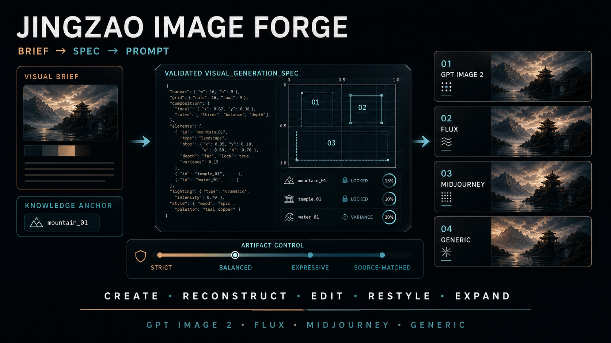

# Jingzao Image Forge — Structured Image Prompt Engineering for Codex

[简体中文](README.zh-CN.md) · [Skill instructions](SKILL.md) · [Visual spec](references/visual-spec.md) · [Prompt compiler](references/prompt-compiler.md)

[](https://github.com/papperrollinggery/jingzao-image-forge/actions/workflows/validate.yml)



**Jingzao Image Forge (镜造 Image Forge)** is a Codex visual-director Skill for structured image prompt engineering, cinematic shot design, spectacle, Chinese-fantasy VFX, and reference-led storyboards. It turns image briefs, reference observations, local edits, and multi-frame plans into a maintainable `visual_generation_spec`, then compiles that specification for OpenAI GPT Image 2, FLUX, Midjourney, or a generic image generator.

It is designed for work where composition, named entities, subject relationships, exact text, spatial edits, materials, lighting, style, or preservation constraints must survive multiple prompt iterations.

## Why Jingzao Image Forge?

Image prompts often fail for reasons that are hard to debug: a named character is diluted into generic traits, cinematic language silently changes the rendering medium, an edit drifts outside its target, or platform-specific controls are invented. Jingzao keeps the visual intent separate from provider syntax so the source specification remains inspectable and reusable.

- **Maintain one source of truth:** scene, subjects, camera, lighting, materials, text, edits, invariants, and exclusions.
- **Use model world knowledge deliberately:** optional `knowledge_anchors` preserve exact characters, places, events, artifacts, and fictional-world terms.
- **Control local edits:** normalized points and regions, explicit “change only” instructions, and preserve lists.
- **Control unwanted image artifacts:** compact budgets for noise, bloom, flare, oily or waxy surfaces, sharpening halos, and decorative particles.
- **Route visual intent automatically:** distinguish narrative film frames, key art, posters, grounded cinema, heightened cinema, graphic stylization, giant-scale spectacle, and genre-specific world logic.
- **Direct camera and relationships:** bind blocking, eyelines, axis, viewer position, shot size, camera height, camera distance, focal length, focus, and motivated light to one viewer task.
- **Build reference-led styleboards:** role-scoped references, independent frame cards, 3×3 assembly, and line-art, hand-drawn, or cinematic-frame finishes.
- **Compile without fake controls:** internal `weight`, `lock`, and `variance` values are never presented as provider-native parameters.
- **Improve from real usage:** evidence-backed problems can become optimization proposals, but the Skill changes only after user approval and regression testing.

## Supported Workflows

| Mode | Use it for |
| --- | --- |
| `create` | New images from a brief, from concise single-subject prompts to complex scenes |
| `reconstruct` | Observable style and composition analysis from an actual supplied image |
| `edit` | Minimal local changes with explicit preservation constraints |
| `restyle` | Change visual treatment while locking identity, pose, geometry, layout, and text |
| `expand` | Extend a canvas while preserving subject position, perspective, light, and continuity |
| `styleboard` | Translate identity, wardrobe, scene, camera, and style references into consistent multi-frame boards |

## 30-Second Installation

Clone the repository into your user-level Codex Skills directory:

```bash
git clone https://github.com/papperrollinggery/jingzao-image-forge.git ~/.codex/skills/jingzao-image-forge
```

Start a new Codex task, then invoke the Skill explicitly:

```text
$jingzao-image-forge Create a 21:9 cinematic key visual from this brief.
Return a validated visual_generation_spec and an OpenAI GPT Image 2 prompt.
```

The Skill also allows normal automatic discovery when a request clearly needs structured image prompting.

## Usage Examples

### Create

```text
$jingzao-image-forge Create a clean studio image of one red ceramic cup
on a pale gray background, 1:1, no text. Compile for FLUX.
```

### Knowledge-aware named entity

```text
$jingzao-image-forge Use the exact named character and requested incarnation
as a knowledge anchor. Keep the original animation medium; "cinematic" refers
to framing, scale, and lighting—not live action. Compile for GPT Image 2.
```

### Local edit

```text
$jingzao-image-forge Edit the moon near (x:16.5%, y:16.4%) so it becomes
physically fractured. Change only the moon; preserve the camera, skyline,
exposure, grade, atmosphere, and surrounding sky.
```

### Expand for later cropping

```text
$jingzao-image-forge Expand this landscape image to 21:9. Keep the lighthouse
at the same relative position and scale; add crop-safe space on both sides.
```

### Narrative film frame

```text
$jingzao-image-forge Create one narrative film frame, not key art.
Analyze the relationship change first, then choose blocking, viewer position,
camera height, distance, focal length, focus, and motivated lighting.
```

### Reference-led nine-grid styleboard

```text
$jingzao-image-forge Use these identity, wardrobe, scene, camera, and hand-drawn
style references to build a 3x3 storyboard. Assign each reference one role,
then choose a direct sheet, independent frames, or hybrid from speed and continuity risk.
```

## How It Works

```text
image brief / observed reference / edit intent
                    ↓
          visual_generation_spec
                    ↓
          deterministic validation
                    ↓
  OpenAI · FLUX · Midjourney · generic prompt
```

For simple requests, Jingzao can return a concise prompt. For exact layouts, multi-subject scenes, reference-based work, or edits, it uses the structured specification.

## Automatic Visual Direction

Jingzao separates dimensions that are often incorrectly collapsed into “cinematic”:

| Dimension | Values |
| --- | --- |
| Deliverable | narrative film frame · cinematic key art · poster · concept art |
| Treatment | grounded cinematic · heightened cinematic · graphic stylized |
| Spectacle scale | intimate · dramatic · monumental · mythic |
| Camera freedom | physical · heightened · impossible |
| Genre logic | user-defined world rule, including Chinese fantasy, xianxia, mythology, giant creatures, science fiction, or documentary realism |

A narrative frame starts from one visible event, relationship pressure, viewer task, and frozen moment. A poster may present assets simultaneously. Monumental and mythic work must prove scale through human/environment comparison, atmosphere, occlusion, parallax, shadow, and environment response. Chinese-fantasy effects require a source, activation protocol, spatial operation, resistance or cost, result, and residue.

## Cinematic Ultrawide

The general template remains 16:9. Use the optional `cinematic_ultrawide` profile when horizontal space carries story or spectacle information:

```json
{
  "canvas": {
    "profile": "cinematic_ultrawide",
    "aspect_ratio": "21:9",
    "dimensions": {"width": 1792, "height": 768}
  }
}
```

Explicit `2.35:1` and `2.39:1` requests are also supported. The Skill does not force every film image into ultrawide.

## Styleboard and Nine-Grid Mode

`styleboard` supports `line_art`, `hand_drawn`, `cinematic_frame`, and mixed presentation. A reference receives one primary role—identity, wardrobe, scene, prop, `camera_action`, style, layout, or palette—and cannot silently control unrelated layers.

Jingzao supports three execution strategies: `sheet_direct` for fastest one-call ideation, `independent_frames` for strict identity and camera continuity, and `hybrid` for a fast direct sheet followed by targeted high-quality replacement of selected or failed cells. `auto` chooses from speed and continuity risk.

## Visual Generation Spec

`knowledge_anchors` are optional. They activate only when an exact named entity can contribute useful prior knowledge or reference grounding.

```json
{
  "visual_generation_spec": "1.0",
  "mode": "create",
  "intent": "Create a period-accurate outdoor crowd scene.",
  "platform": "openai",
  "canvas": {"aspect_ratio": "16:9"},
  "inputs": [],
  "knowledge_anchors": [
    {
      "name": "Bethel, New York on August 16, 1969",
      "context": "period-accurate Woodstock-era scene",
      "strategy": "auto",
      "reference_ids": [],
      "verification": "unverified"
    }
  ],
  "constraints": {
    "must_preserve": [],
    "must_change": [],
    "exclude": ["modern objects", "logos", "watermarks"]
  }
}
```

Strategies:

- `auto`: model knowledge without references; hybrid grounding when matching references exist.
- `model_knowledge`: preserve the exact entity early and let a capable model apply existing knowledge.
- `reference`: ground canonical appearance in supplied reference inputs.
- `hybrid`: combine exact named-entity knowledge with version-matched references.

World knowledge improves generation; it is not proof of canonical accuracy. Keep verification `unverified` until checked against a trusted visible reference or confirmed by the user.

## Platform-Aware Compilation

| Target | Compilation behavior |
| --- | --- |
| OpenAI GPT Image 2 | Front-loads knowledge anchors; separates prompt prose from `model`, `quality`, and `size`; preserves edit invariants |
| FLUX.2 | Uses natural language or structured JSON; does not invent an unsupported negative-prompt channel |
| Midjourney | Keeps visible content first and provider parameters at the end; coordinates remain semantic anchors |
| Generic | Produces portable prompt, negative prompt, parameters, and explicit provider warnings |

Compile a validated specification:

```bash
python3 scripts/validate_spec.py examples/atomic-cyber-live-action.json
python3 scripts/validate_spec.py examples/narrative-film-frame.json
python3 scripts/validate_spec.py examples/styleboard-3x3.json
python3 scripts/compile_prompt.py examples/atomic-cyber-live-action.json --platform openai
python3 scripts/compile_prompt.py examples/atomic-cyber-live-action.json --platform flux
python3 scripts/compile_prompt.py examples/atomic-cyber-live-action.json --platform midjourney
python3 scripts/compile_prompt.py examples/atomic-cyber-live-action.json --platform generic
```

The validator and compiler use only the Python standard library.

## Artifact and Surface Quality

Jingzao uses one optional `render.artifact_budget` instead of a long universal cleanup prompt:

| Budget | Best for |
| --- | --- |
| `strict` | Product images, typography, diagrams, minimal editorials, clean gradients |
| `balanced` | Default premium images with restrained scene-motivated effects |
| `expressive` | Painterly, analog, fantasy, or VFX-heavy imagery with intentional artifacts |
| `source_matched` | Edits and expansions that must preserve the source artifact profile |

The quality layer separates material roughness, highlight behavior, texture scale, focal detail, noise/grain, bloom, flare, particles, and sharpness. Intentional film grain, brush texture, wet gloss, and practical-light flare are preserved when requested; unmotivated speckle, global oily sheen, and equal-detail rendering are not treated as “quality.” See [Artifact and Material Quality Controls](references/quality-controls.md).

## Repository Structure

```text
.
├── SKILL.md                     Codex Skill entrypoint
├── agents/openai.yaml           UI metadata and invocation policy
├── templates/visual-spec.json   Reusable specification template
├── references/                  Schema and platform compilation guidance
├── scripts/                     Validator and prompt compiler
├── examples/                    Synthetic validated example
├── tests/                       Regression tests and behavioral evals
└── assets/                      README visual assets
```

## Validation

```bash
python3 -m py_compile scripts/validate_spec.py scripts/compile_prompt.py tests/test_skill.py
python3 scripts/validate_spec.py templates/visual-spec.json
python3 scripts/validate_spec.py examples/atomic-cyber-live-action.json
python3 -m unittest discover -s tests -v
```

Current local baseline: **50 regression tests** covering all six modes, three validated examples, material-schema integrity, canvas profiles, local-edit alternatives, provider compilation and parameter ranges, malformed-input safety, language metadata, knowledge anchors, visual-direction consistency, cinematic ultrawide validation, narrative shot contracts, causal effects, styleboard role assignments and strategy guidance, square and non-square frame/canvas geometry, frame cards, artifact budgets, and cross-platform prompt survival.

Manual forward test: a dark environmental portrait combining natural skin, indigo fabric, brushed brass, worn wood, and one practical lamp was generated and visually inspected. Material separation, shadow readability, selective detail, and source-motivated highlights passed; no uncontrolled speckle, floating light orbs, global oily gloss, sharpening halos, or synthetic bokeh were observed. The test image is intentionally not committed to this repository.

Additional direction forward tests passed: a relationship-driven ferry-terminal frame read as a motivated film still rather than a poster; a monumental Chinese-fantasy shot proved scale through architecture, water pressure, occlusion, and one causal formation effect; and a one-call `sheet_direct` 3×3 hand-drawn storyboard produced nine readable 16:9 cells with stable characters, geography, prop state, and reading order. These test images are not committed.

## Design Principles and Research References

Jingzao is independently implemented, but its publication and quality methodology were cross-checked against strong primary examples:

- [OpenAI GPT Image Generation Models Prompting Guide](https://developers.openai.com/cookbook/examples/multimodal/image-gen-models-prompting-guide): structured prompts, real materials and skin texture, natural color, limited retouching, world knowledge, and iterative refinement.
- [OpenAI Plugins](https://github.com/openai/plugins): current Codex plugin and Skill packaging structure.
- [Anthropic Skills](https://github.com/anthropics/skills): concise capability definition, self-contained Skill structure, installation, examples, and limitations.
- [GPT-Image2-Skill](https://github.com/wuyoscar/GPT-Image2-Skill): reference-gallery routing, category-specific prompt craft, exact text, and separation of materials, lighting, and palette.
- [Superpowers](https://github.com/obra/superpowers): evidence-first workflows, regression testing, behavioral evaluation, and explicit limitations.
- [ARRI cinematography case studies](https://www.arri.com/news-en/alexa-lf-signature-primes-and-skypanels-on-the-film-rrr): focal lengths, movement, scale, and camera choices tied to shot requirements rather than generic style tokens.
- [Pixar RenderMan cinematography research](https://renderman.pixar.com/stories/incredible-cinematography): camera/staging and lighting systems change with character, sequence intensity, and viewer focus while preserving a common visual language.
- [Cinematic Storyboard Generator](https://github.com/NBchitu/cinematic-storyboard-generator): public 3×3 storyboard packaging, style bibles, per-panel camera intent, and provider-ready prompts; Jingzao keeps one-call boards as the speed path and independent frames as the precision path.

The resulting method is intentionally compact: exact intent first, optional structured controls only when they add value, deterministic validation, one artifact budget, targeted iteration, and visual verification before quality claims.

## Boundaries

- This Skill prepares specifications and prompts; it does not generate images by itself. Pair it with Codex `$imagegen` or another image-generation system for execution.
- A coordinate is a semantic anchor, not a pixel-accurate mask.
- Reconstruction describes observable visual attributes; it cannot recover an unknowable original prompt.
- Provider behavior changes. Recheck current official documentation before changing models, parameters, limits, or capability claims.
- A successful compile does not prove visual quality, identity accuracy, or provider compliance. Inspect generated outputs.

## FAQ

### What is Jingzao Image Forge?

It is a Codex Skill that converts image-generation intent into a structured visual specification and platform-ready prompts.

### Why use a visual specification instead of one long prompt?

The specification separates stable facts and invariants from creative variation. It makes scene relationships, exact text, edits, and provider differences easier to inspect, test, and revise.

### Does it support GPT Image 2 world knowledge?

Yes. Exact named entities can be preserved as optional knowledge anchors and placed early in OpenAI prompts. Accuracy still requires visual verification.

### Can it edit a precise region?

It can describe points and approximate regions. Pixel-accurate editing still requires an actual mask or editor-region capability.

### Is it tied to one image model?

No. The source specification is provider-neutral and currently compiles for OpenAI, FLUX, Midjourney, and generic targets.

### How does it prevent film frames from looking like posters?

Narrative profiles require a visible event, relationship pressure, viewer task, frozen moment, staging, camera motivation, lens rationale, and motivated lighting. They explicitly guard against simultaneous asset showcase and equal-detail rendering.

### Does it support nine-grid storyboards?

Yes. `styleboard` supports 3×3 boards, role-scoped references, continuity locks, one-call direct sheets, independent native-ratio frames, hybrid replacement, and line-art, hand-drawn, cinematic-frame, or mixed finishes.

## Project Status

The Skill is actively developed from observed failures and regression-tested before its installed copy is synchronized. Issues and focused pull requests are welcome.

This is an independent community project and is not affiliated with OpenAI, Black Forest Labs, Midjourney, Anthropic, or their products.
