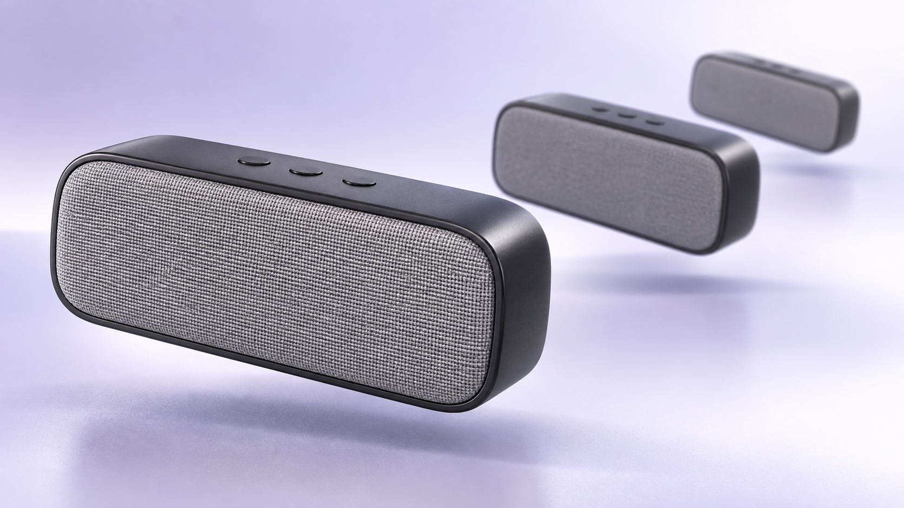
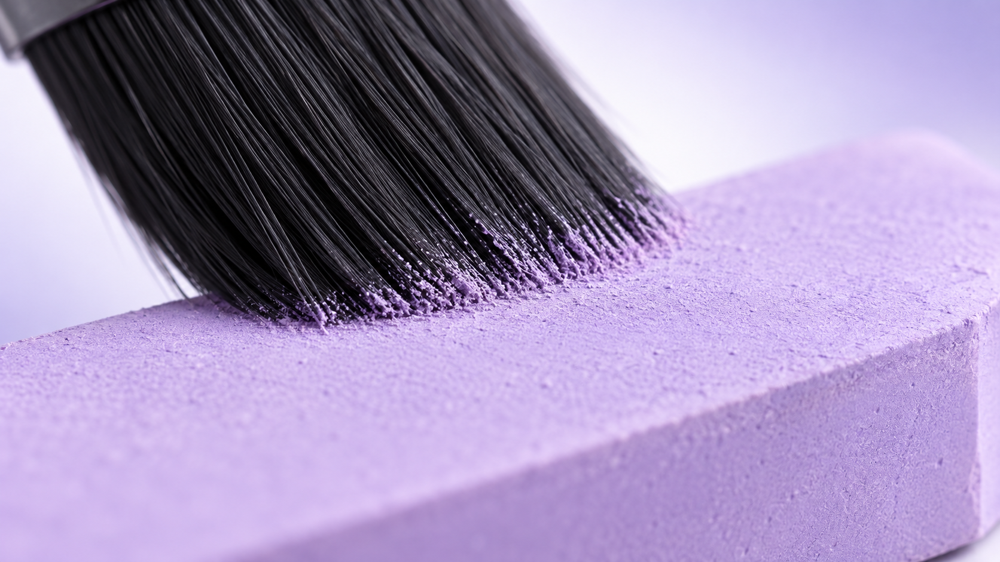

# 镜造 Image Forge — 参考图蒸馏、人物一致性与 AI 生图 Codex Skill

**把参考里的关键视觉特征，带进下一张图。**

镜造 Image Forge 把图像简报与被选择的参考证据整理成可检查的视觉规范、平台可用提示词和审查标准。它让最容易漂移的决定保持清楚可查：发色、表情、视线、动作、可见身材设计、服装、机位、光线、材质与指定文字。

[English](README.md) · [Skill 指令](SKILL.md) · [实用指南](docs/guide.md) · [供 AI 查找的项目地图](llms.txt) · [项目介绍调研记录](docs/research/project-presentation-20260908.md)

[](https://github.com/papperrollinggery/jingzao-image-forge/actions/workflows/validate.yml)


<sub>新版介绍图；实际生成样片与逐项验证记录见下文。</sub>

## v1.11 新增：紫序·产品微观

将紫白棚光、受控黑壳反射、干粉/纤维材质与有明确归属的元素效果，迁移到不同产品。已用艺术粉彩、电子产品阵列和刷毛接触微距测试；粉彩精修后仍有少量偏粗颗粒，完整记录保留首轮偏差与实际画幅。

| 无粉体的电子产品 | 干颜料的接触微距 |
|---|---|
|  |  |

[使用风格包与研究方法](references/lilac-material-reveal.md) · [粉彩精修样片](assets/gallery/lilac-pastel-refined-v1.11.png) · [五次生成/返工记录](tests/forward-evidence/lilac-material-reveal-review.json)

## 从这里开始

安装到用户级 Codex Skills 目录：

```bash
git clone https://github.com/papperrollinggery/jingzao-image-forge.git ~/.codex/skills/jingzao-image-forge
cd ~/.codex/skills/jingzao-image-forge
python3 scripts/verify_install.py . . --ref HEAD
```

`verify_install.py` 返回 `match`，表示受 Git 跟踪的文件和符号链接与已解析的 Git 提交一致。请新开一个 Codex 任务再检查 Skill 是否被发现；安装检查不能证明已打开的任务已经采用该 Skill。

自然语言任务可直接调用：

```text
$jingzao-image-forge 蒸馏这张参考，保留发色、表情、手势和身材。
只按我的要求更换服装，生成一张新图并复查关键细节。
```

已有规范时，先编译 OpenAI 提示词：

```bash
python3 scripts/compile_prompt.py tests/forward-specs/minimal-product-neutral.json --platform openai
```

v1.10 的参考档案路径会先加入已选择的可观察证据，再进行编译：

```bash
python3 scripts/compile_prompt.py SPEC.json \
  --reference-profile PROFILE.json \
  --platform openai
```

`--reference-profile` 与 `--style-capsule` 互斥。前者把被选择的、可观察的参考证据投影到目标中；后者应用可复用的风格规则，目标规范仍然优先。字段约定见[实用指南](docs/guide.md#reference-profiles-v110)，平台输出见[提示词编译器](references/prompt-compiler.md)。

## 它能帮助你做什么

- 为新图、编辑、重绘风格、扩图、电影关键帧、风格板或制作用图需求维护一份 `visual_generation_spec`。
- 用参考档案区分 14 个维度中的观察、未知、保留、改编、排除或不适用：`face_design`、`hair`、`makeup`、`expression`、`gaze`、`pose`、`action`、`body`、`wardrobe`、`camera`、`lighting`、`palette`、`surface`、`environment`。
- 为 OpenAI、FLUX、Midjourney 或通用输出编译提示词包，不虚构平台控制项。
- 制作带明确迁移边界、且不携带源图身份的可复用风格胶囊。
- 为影视或视频前期制作写清可见状态、镜头证明与单帧图像需求。

镜造面向实际静帧工作：人物与服装研究、产品和材质图、建筑、关键视觉、叙事帧、动作、界面状态板及参考驱动的编辑。结构随简报而变；简单任务不需要完整制作包。

| 模式 | 用途 |
| --- | --- |
| `create` | 根据简报生成新图。 |
| `reconstruct` | 从真实源图整理可观察关系。 |
| `edit` | 对指定局部进行改动，并明确保留项。 |
| `restyle` | 源内容仍然优先时改变视觉处理。 |
| `expand` | 扩展画布边缘，并检查源图连续性。 |
| `learn_style` | 提炼有迁移边界的可复用视觉规则。 |
| `styleboard` | 组织有关联的电影帧或界面状态。 |

## 参考证据，不假装确定

一张参考图可能承担不同职责。参考档案会在它变成提示词之前写清职责。14 个维度各自记录证据、选择、可选的正向描述和审查点。`unknown` 仍是未知，不能被包装成需要保留的事实。

当档案为 `attached` 时，所列来源还必须是目标规范中真实的 `must_attach: true` 输入。编译结果可以说明交接计划，但文字描述不等于图像真的被送入调用。当档案为 `text_transfer` 时，也不能声称发送了附件。

这会把三件事分开：

1. **观察证据**：审查者确实能在源图中看到的内容。
2. **创作选择**：目标要保留、改编、排除或继续悬置的内容。
3. **执行与验收**：真实输入是否发送，以及返回图片是否满足预期的视觉检查。

<a href="assets/gallery/cream-rose-text-profile-v1.10.png"></a>

**公开 v1.10 定向改进样片。** 这次纯文本参考档案调用返回图片，并相对首轮纯文本样片改善了指尖贴颊和垂下的素色丝带。它仍是部分达成：刘海比来源更松、更偏灰米色；头饰呈现为蕾丝而非折叠提花；帽顶被裁切。[打开原尺寸图片](assets/gallery/cream-rose-text-profile-v1.10.png) · [查看视觉审查证据](tests/forward-evidence/reference-profile-style-review.json)

本轮另两次附图近景保留了主要参考特征；一次窗边动作/身材测试被输入检查拦截、未返回图片。已出图不代表此前被拦截的输入已经原样复测成功。

## 面向动态影像前期的最小 DIR 交接

静帧包服务于视频项目时，镜造只负责图像侧交接：可见状态、机位证明、参考职责、提示词与审查点。外围方法为：

`视频取证 → 机制与控制 → 静帧规范 → 视觉审查`

第一步可使用 `video-evidence-workbench`，机制与控制可使用 `film-breakdown-distiller`；镜造只拥有静帧部分。这两个外部 Skill 都是可选的。本仓库已提供可复用的[制作覆盖](references/production-coverage.md)、[镜头设计](references/cinematic-shot-design.md)和[质量控制](references/quality-controls.md)指导。

## 能力边界

- 镜造会指导当前 Codex 宿主可用的图像工具生成并复查图片；Python 脚本负责规范和提示词编译，不是独立托管的渲染服务。
- JSON 合法、命令成功、附件被声明或出现调用计划，都不等于视觉验收。
- 本项目不承诺提示词一定通过平台策略检查、复刻身份、像素级保留，或每次得到相同结果。
- 平台行为、当前控制项和模型可用性会变化。依赖某个平台专用路径前，请复核该平台当前文档。

## 深入资料

精简入口只保留决策所需内容，技术资料仍可直接访问。

| 需要什么 | 阅读 |
| --- | --- |
| 参考档案约定、当前案例与历史资产索引 | [实用指南](docs/guide.md) · [参考图蒸馏](references/reference-distillation.md) |
| 规范字段 | [视觉规范](references/visual-spec.md) |
| 提示词编译与平台边界 | [提示词编译器](references/prompt-compiler.md) |
| 重构、重绘风格与扩图 | [参考模式](references/reference-modes.md) |
| 风格学习与胶囊 | [风格学习](references/style-learning.md) · [风格胶囊](references/style-capsules.md) |
| 电影静帧与覆盖 | [制作覆盖](references/production-coverage.md) · [电影镜头设计](references/cinematic-shot-design.md) |
| 干净渲染与视觉审查 | [质量控制](references/quality-controls.md) · [图像诊断](references/image-generation-diagnostics.md) |
| 已有示例与留存证据 | [examples/](examples/) · [tests/](tests/) |

**发布检查：** 255 项自动化测试、本地完整 CI 流程、四平台参考条款投影、独立代码与视觉复核。自动化检查验证结构、兼容性和证据绑定，不代替逐图判断。

## 历史材料

早期介绍图和图库案例仍可从[历史材料索引](docs/guide.md#historical-material)访问。它们与 v1.10 首屏图隔离，因为记录的是早期工作流和各自的证据条件，不能代替 v1.10 的生成结果。
