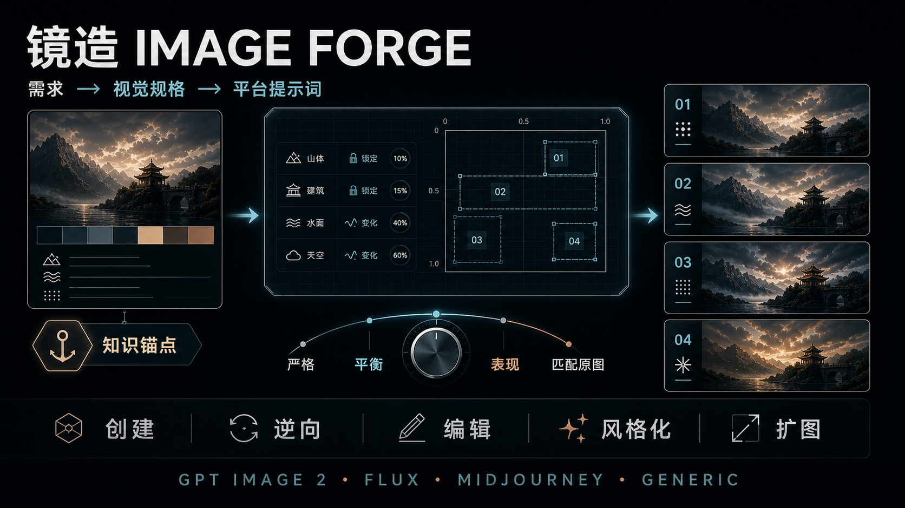

# 镜造 Image Forge — 面向 Codex 的结构化生图提示词 Skill

[English](README.md) · [Skill 指令](SKILL.md) · [视觉规格](references/visual-spec.md) · [平台编译规则](references/prompt-compiler.md)

[](https://github.com/papperrollinggery/jingzao-image-forge/actions/workflows/validate.yml)



**镜造 Image Forge** 是一个面向 Codex 的结构化生图提示词 Skill。它把图片需求、参考图观察或局部修改意图转换为可维护的 `visual_generation_spec`，再编译为 OpenAI GPT Image 2、FLUX、Midjourney 或 generic 提示词。

它适合需要稳定控制构图、命名实体、人物关系、精确文字、空间修改、材质、灯光、风格以及保留约束的图片工作流。

## 为什么使用镜造？

- **统一视觉事实源：** 场景、人物、镜头、灯光、材质、文字、修改、保留项和排除项集中维护。
- **有意识地利用模型世界知识：** 可选 `knowledge_anchors` 保留精确的人物、地点、事件、器物和世界观专名。
- **控制局部修改：** 使用归一化坐标、区域、“只修改”指令和明确保留列表。
- **控制常见画面伪影：** 用紧凑质量档管理噪点、光斑、bloom、油蜡感、锐化光环和装饰性粒子。
- **不伪造平台参数：** 内部 `weight / lock / variance` 不会被包装成模型原生控制值。
- **从真实使用中优化：** 发现可复用问题时先提出证据和策略，经用户同意并回归测试后才修改 Skill。

## 支持的工作模式

| 模式 | 适用场景 |
| --- | --- |
| `create` | 从简洁单主体到复杂场景的新图创建 |
| `reconstruct` | 基于实际参考图，区分可观察特征与未验证推测 |
| `edit` | 带明确保留约束的最小局部修改 |
| `restyle` | 锁定身份、姿势、几何、版式和文字，只改变视觉处理 |
| `expand` | 扩展画布，同时保持主体位置、透视、灯光与环境连续性 |

## 30 秒安装

把仓库克隆到当前用户的 Codex Skills 目录：

```bash
git clone https://github.com/papperrollinggery/jingzao-image-forge.git ~/.codex/skills/jingzao-image-forge
```

新建一个 Codex 任务，然后显式调用：

```text
$jingzao-image-forge 根据这份需求创建 21:9 电影级关键视觉，
输出通过校验的 visual_generation_spec 和 GPT Image 2 提示词。
```

当任务明显需要结构化图片提示词时，也允许自动发现。

## 使用示例

### 创建

```text
$jingzao-image-forge 创建一个红色陶瓷杯的棚拍产品图，
浅灰背景，1:1，不要文字，编译为 FLUX 提示词。
```

### 利用命名实体与世界知识

```text
$jingzao-image-forge 把精确人物名和指定版本作为 knowledge anchor，
保持原动画媒介；“电影感”只指构图、规模和灯光，不转换成真人实拍。
目标平台：GPT Image 2。
```

### 局部修改

```text
$jingzao-image-forge 把 (x:16.5%, y:16.4%) 附近的月球改成物理破碎状态。
只修改月球，保持机位、城市轮廓、曝光、调色、氛围和周围天空不变。
```

### 扩图

```text
$jingzao-image-forge 把横版图片扩展为 21:9。
灯塔的相对位置和大小不变，左右增加可供后续裁切的安全留白。
```

## 工作流程

```text
图片需求 / 参考图观察 / 修改意图
                ↓
      visual_generation_spec
                ↓
          确定性规格校验
                ↓
OpenAI · FLUX · Midjourney · generic 提示词
```

简单需求可以直接交付精简提示词；多人物、精确版式、参考图或编辑任务则使用完整规格。

## 可选知识锚点

`knowledge_anchors` 不是必填项。出现可被模型识别的专名，或用户提供匹配参考图时才启用：

- `auto`：无参考图时利用模型知识；有匹配参考图时自动采用混合方式。
- `model_knowledge`：保留精确实体名，让具备相关知识的模型优先理解。
- `reference`：以用户提供的参考图约束标准形象。
- `hybrid`：结合精确实体名和版本匹配的参考图。

世界知识只是创作依据，不是准确性证明。没有可信参考图或用户确认时，标准形象应保持 `unverified`。

## 平台编译

| 目标平台 | 处理方式 |
| --- | --- |
| OpenAI GPT Image 2 | 专名锚点前置；提示词与 `model / quality / size` 分离；保留编辑不变量 |
| FLUX.2 | 支持自然语言或结构化 JSON；不虚构 negative prompt 通道 |
| Midjourney | 先写画面内容，参数统一置于末尾；坐标仍是语义锚点 |
| Generic | 输出可移植 prompt、negative prompt、参数和平台警告 |

```bash
python3 scripts/validate_spec.py examples/atomic-cyber-live-action.json
python3 scripts/compile_prompt.py examples/atomic-cyber-live-action.json --platform openai
python3 scripts/compile_prompt.py examples/atomic-cyber-live-action.json --platform flux
python3 scripts/compile_prompt.py examples/atomic-cyber-live-action.json --platform midjourney
python3 scripts/compile_prompt.py examples/atomic-cyber-live-action.json --platform generic
```

验证器和编译器仅依赖 Python 标准库。

## 伪影与材质质量控制

镜造使用一个可选的 `render.artifact_budget`，不把所有清理词堆进每条提示词：

| 质量档 | 适用场景 |
| --- | --- |
| `strict` | 产品图、精确文字、图表、极简编辑设计和干净渐变 |
| `balanced` | 默认高质量图片，只允许克制且由场景驱动的效果 |
| `expressive` | 绘画、胶片、幻想或重 VFX 画面，允许有意的媒介伪影 |
| `source_matched` | 需要继承原图颗粒、光斑、锐度和表面响应的编辑与扩图 |

质量层会分别管理材质粗糙度、高光、纹理尺度、焦点细节、噪声/颗粒、bloom、flare、粒子与锐度。用户明确要求的胶片颗粒、笔触、湿润高光或实际光源 flare 会被保留；无来源噪点、全局油亮和全画面同等锐利不会被当作“高级感”。详见[伪影与材质质量控制](references/quality-controls.md)。

## 目录结构

```text
.
├── SKILL.md                     Codex Skill 入口
├── agents/openai.yaml           界面信息与调用策略
├── templates/visual-spec.json   可复用视觉规格模板
├── references/                  规格和平台编译说明
├── scripts/                     验证器与提示词编译器
├── examples/                    通过验证的合成示例
├── tests/                       回归测试与行为评测
└── assets/                      README 视觉素材
```

## 验证

```bash
python3 -m py_compile scripts/validate_spec.py scripts/compile_prompt.py tests/test_skill.py
python3 scripts/validate_spec.py templates/visual-spec.json
python3 scripts/validate_spec.py examples/atomic-cyber-live-action.json
python3 -m unittest discover -s tests -v
```

当前本机基线为 **21 项回归测试**，覆盖规格校验、材质字段完整性、局部修改约束、平台编译、知识锚点保留、自动混合策略、伪影质量档和跨平台专名存活。

人工 forward test：使用暗场环境人像同时测试自然皮肤、靛蓝布料、拉丝黄铜、旧木材和单一实用灯具。实际产图经过视觉检查，材质分离、暗部可读性、焦点细节和受光源驱动的高光均通过；未发现失控噪点、漂浮光球、全局油蜡感、锐化光环或合成 bokeh。测试图不提交到公开仓库。

## 设计方法与研究依据

镜造为独立实现，但发布结构和质量方法对照了以下高质量一手资料：

- [OpenAI GPT Image 生图提示指南](https://developers.openai.com/cookbook/examples/multimodal/image-gen-models-prompting-guide)：结构化提示、真实皮肤与材质、自然色彩、克制修饰、世界知识和逐次迭代。
- [OpenAI Plugins](https://github.com/openai/plugins)：当前 Codex 插件与 Skill 的组织方式。
- [Anthropic Skills](https://github.com/anthropics/skills)：清楚的能力定义、自包含结构、安装、示例和限制。
- [GPT-Image2-Skill](https://github.com/wuyoscar/GPT-Image2-Skill)：参考图库路由、分类提示方法、精确文字以及材质/灯光/色彩分离。
- [Superpowers](https://github.com/obra/superpowers)：证据优先、回归测试、行为评测和明确能力边界。

最终方法保持克制：先锁定精确意图，只在有价值时启用结构化控制；确定性校验；每次只使用一个伪影质量档；定向迭代；未检查实际产图前不宣称质量通过。

## 能力边界

- Skill 负责规格和提示词，不直接生成图片；实际出图可配合 Codex `$imagegen`。
- 文字坐标是语义锚点，不等于像素级蒙版。
- 逆向分析只能描述可观察特征，不能恢复未知的原始提示词。
- 修改模型、参数、限制或平台能力前，应重新核对官方文档。
- 编译成功不代表画面质量、角色准确性或平台兼容性已经验证，必须检查实际产图。

## 常见问题

### 镜造 Image Forge 是什么？

它是一个把图片需求转换成结构化视觉规格和多平台提示词的 Codex Skill。

### 为什么不用一段很长的提示词？

结构化规格能把稳定事实、保留约束和允许变化分离，使关系、文字、局部修改和平台差异更容易维护与测试。

### 能利用 GPT Image 2 的世界知识吗？

可以。精确命名实体可作为可选知识锚点，并在 OpenAI 提示词前部保留；最终准确性仍需视觉检查。

### 能进行像素级局部修改吗？

规格可以描述点位和近似区域。像素级边界仍需要真实蒙版或平台编辑区域能力。

### 是否绑定某个图片模型？

不绑定。视觉规格保持平台中立，目前支持 OpenAI、FLUX、Midjourney 和 generic 编译。

## 项目状态

项目会根据真实使用中发现的问题持续改进，并在同步安装副本前运行结构校验、规格验证、回归测试和平台编译验收。

本项目为独立社区项目，与 OpenAI、Black Forest Labs、Midjourney、Anthropic 及其产品无隶属关系。
