# 镜造 Image Forge — 面向 Codex 的视觉导演、风格学习与结构化生图 Skill

[English](README.md) · [Skill 指令](SKILL.md) · [视觉规格](references/visual-spec.md) · [平台编译规则](references/prompt-compiler.md)

[](https://github.com/papperrollinggery/jingzao-image-forge/actions/workflows/validate.yml)

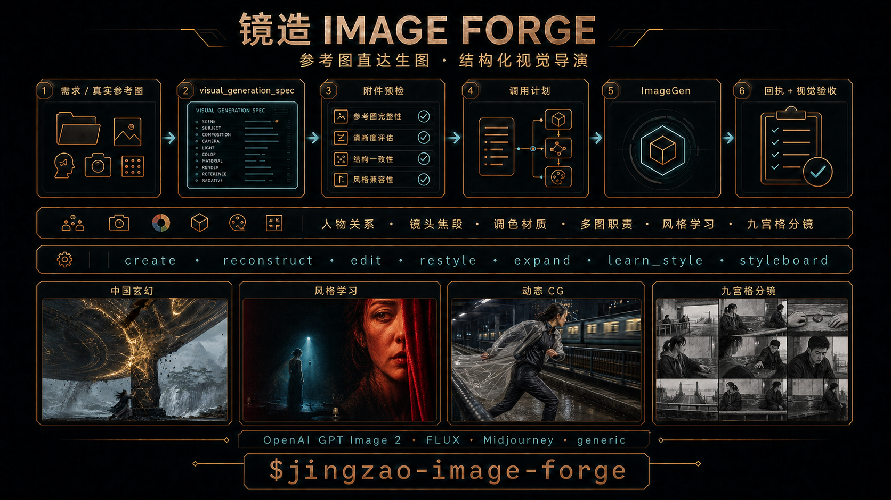

新版视觉套件：[功能推荐页](assets/jingzao-image-forge-recommendation-zh-v3.png) · [微信群推荐卡](assets/jingzao-image-forge-wechat-card-zh-v3.png) · [旧版卡片](assets/jingzao-image-forge-group-card-zh-v2.png)

首屏案例依据：[断桥救援规格](tests/forward-specs/cinematic-bridge-rescue.json) · [路径追踪机械锦鲤规格](tests/forward-specs/path-traced-koi-automaton.json) · [中国玄幻规格](examples/causal-fantasy-effect.json) · [绯夜风格胶囊](references/style-capsules/crimson-nocturne-wuxia-montage.json) · [九宫格规格（仅人工视觉复核）](examples/styleboard-3x3.json)

**镜造 Image Forge** 是一个面向 Codex 的视觉导演 Skill，覆盖结构化生图提示词、参考图风格学习、电影镜头、美术指导、产品、时尚、建筑、插画、动画、纪实、实验媒介、巨物奇观、中国玄幻特效和分镜板。它把图片需求、参考观察、局部修改、可复用风格和多镜规划转换为可维护的 `visual_generation_spec`，再编译为 OpenAI GPT Image 2、FLUX、Midjourney 或 generic 提示词。

它适合需要稳定控制构图、命名实体、人物关系、精确文字、空间修改、材质、灯光、风格以及保留约束的图片工作流。

## 实际生成案例

以下均为 2026-08-19 至 20 日使用内置 ImageGen 完成并经过实际视觉检查的输出。其中十二张已在 forward-test manifest 中绑定哈希或回执；九宫格与材质写实图因原始执行回执或提示记录未保留，仅作为人工视觉复核示例。它们用于展示不同路由与故障控制，不代表每次生成都能确定性复现。对照组、失败稿和修复前版本不会混入案例区。

<table>
  <tr>
    <td width="50%" valign="top"><strong>21:9 断桥救援剧情帧</strong><br>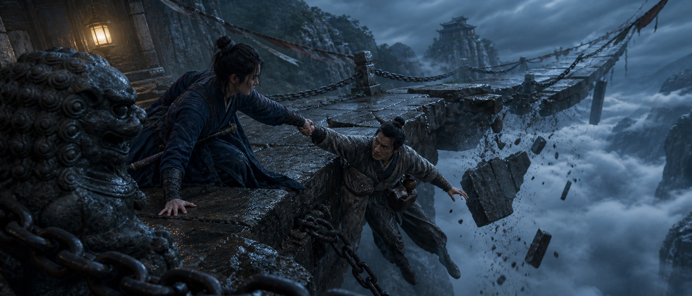<br><sub>单一可读抓握、支撑反力、未完成动作、前景遮挡、断桥地理、云海尺度和有来源灯笼光共同服务剧情。<a href="tests/forward-specs/cinematic-bridge-rescue.json">查看规格</a></sub></td>
    <td width="50%" valign="top"><strong>路径追踪机械锦鲤</strong><br><br><sub>陶瓷、黄铜、玻璃与水通过独立粗糙度、反射、折射、接触、留白和干净路径追踪渐变保持清晰分离。<a href="tests/forward-specs/path-traced-koi-automaton.json">查看规格</a></sub></td>
  </tr>
  <tr>
    <td width="50%" valign="top"><strong>绯夜胶片拼贴：爵士</strong><br>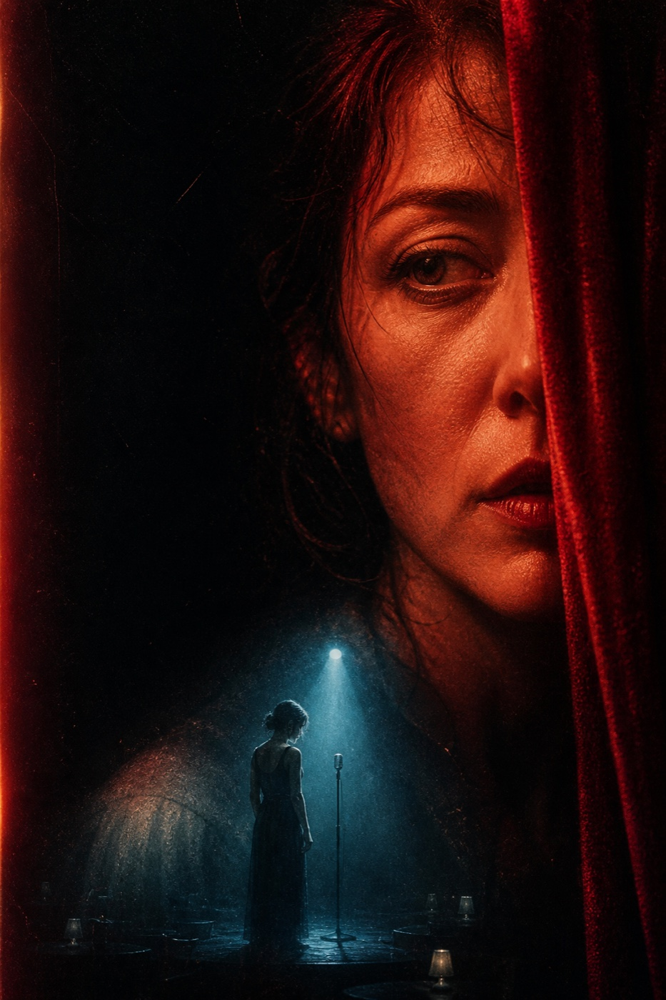<br><sub>极近人物主层、微型叙事记忆、深黑场、红蓝色彩归属、不均匀旧印刷和受控双重曝光。</sub></td>
    <td width="50%" valign="top"><strong>因果型中国玄幻奇观</strong><br>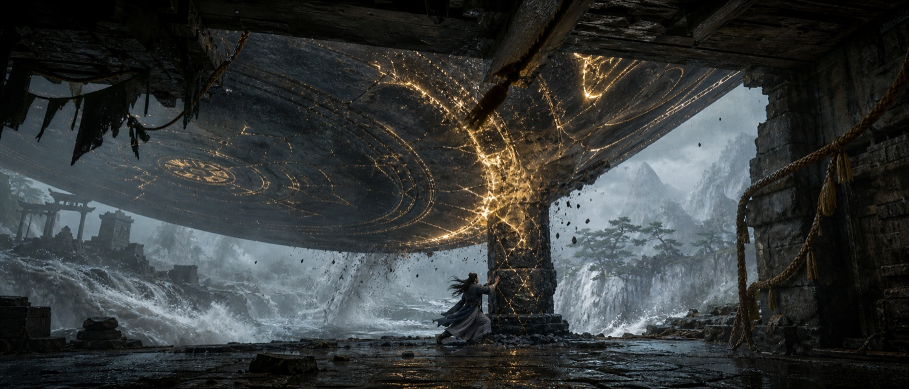<br><sub>通过人景比例、近景压迫、受力路径、接触、阻力、材质破裂与环境反馈证明尺度。<a href="examples/causal-fantasy-effect.json">查看规格</a></sub></td>
  </tr>
  <tr>
    <td width="50%" valign="top"><strong>一键九宫格分镜</strong><br>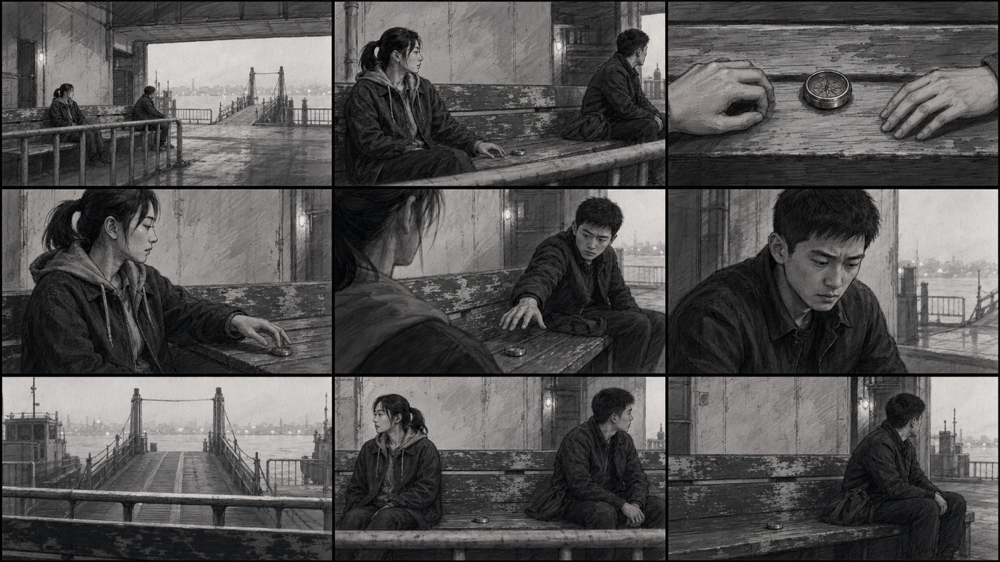<br><sub>人工视觉复核：九格可读、空间与手绘质感稳定；原始参考图交付回执未保留，因此不作为 manifest 绑定证据。<a href="examples/styleboard-3x3.json">查看规格</a></sub></td>
    <td width="50%" valign="top"><strong>动态 CG 时尚镜头</strong><br>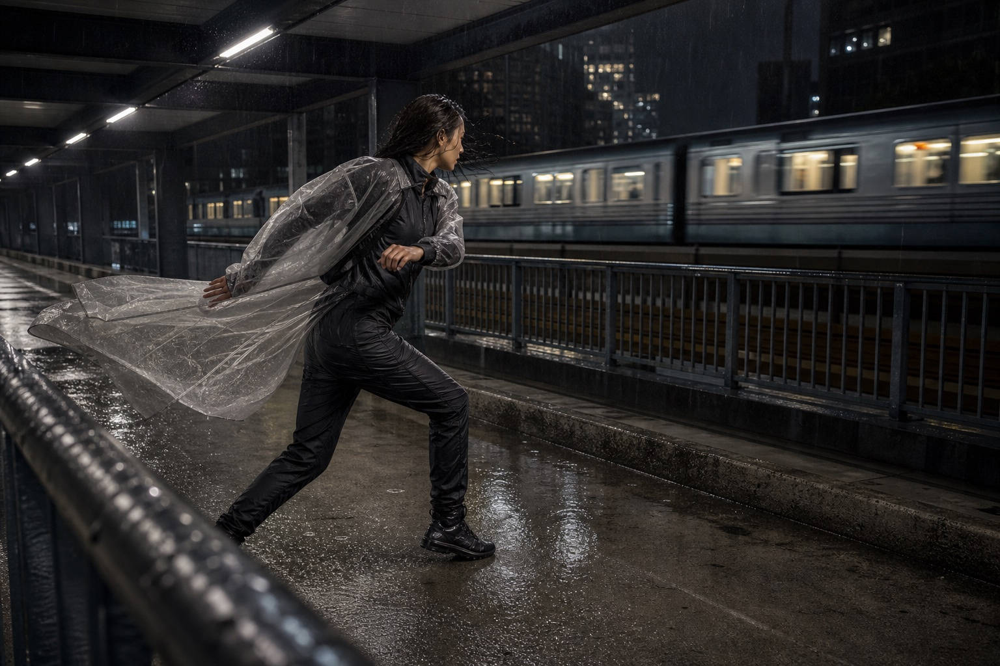<br><sub>动作阶段、衣料拖拽、湿材质、列车运动轴、接触、景深层次和动机光线均可读；不声称实际运行了 Unreal、Blender 或 Lumen。<a href="tests/forward-specs/cg-fashion-rain-platform.json">查看规格</a></sub></td>
  </tr>
  <tr>
    <td width="50%" valign="top"><strong>电影剧情帧</strong><br>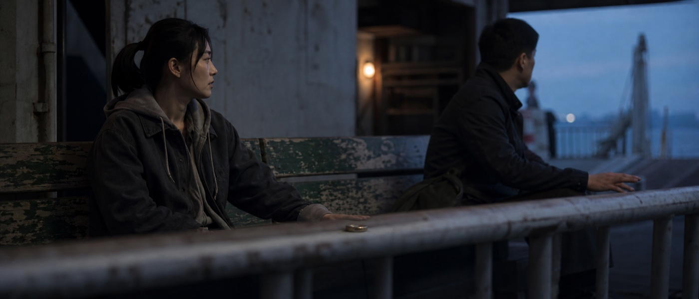<br><sub>人物调度、分离眼线、前景遮挡、克制实景光，以及未完成的剧情瞬间；避免角色并排摆拍成海报。<a href="examples/narrative-film-frame.json">查看规格</a></sub></td>
    <td width="50%" valign="top"><strong>绯夜胶片拼贴：科幻</strong><br>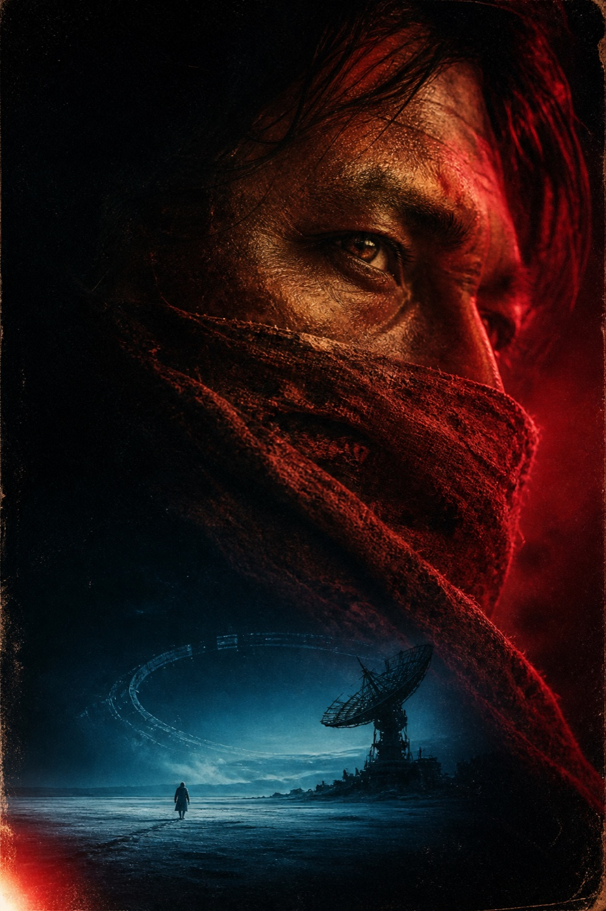<br><sub>同一胶囊换到完全不同的人物和世界，未带回原人物、服装、文案、签名、水印或精确版式。<a href="references/style-capsules/crimson-nocturne-wuxia-montage.json">查看胶囊</a></sub></td>
  </tr>
  <tr>
    <td width="50%" valign="top"><strong>石墨铜产品跨题材迁移</strong><br><br><sub>同一个证据绑定胶囊进入紧凑产品场景，同时保留空白标签、干净轮廓、哑光纸张和选择性铜色响应。</sub></td>
    <td width="50%" valign="top"><strong>保持原图结构的孔版印刷迁移</strong><br>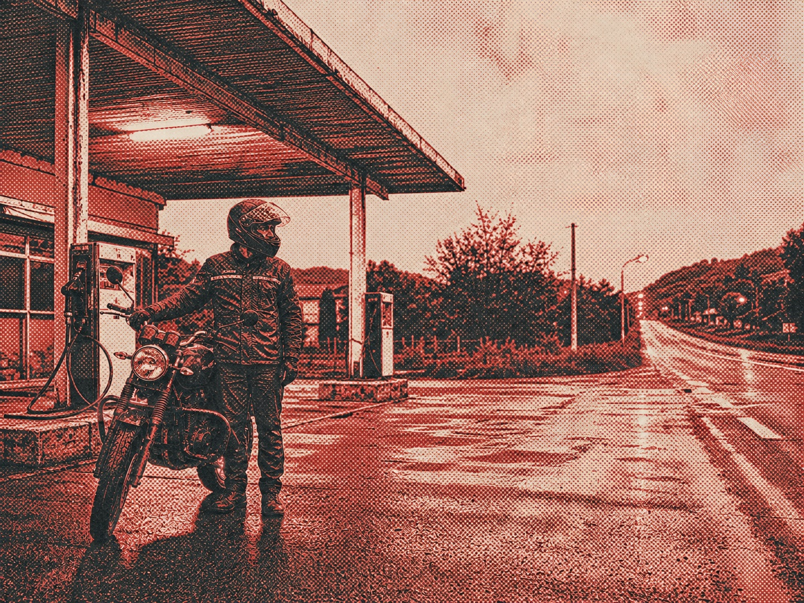<br><sub>真实原图直接进入 ImageGen；人物、摩托、机位、4:3 裁切和站点几何保持，只改变媒介。<a href="tests/forward-specs/restyle-risograph-service-station.json">查看规格</a></sub></td>
  </tr>
  <tr>
    <td width="50%" valign="top"><strong>无虚构文字的触感产品</strong><br><br><sub>一次最小 no-text 修复保留了产品几何、纸艺触感、铜色响应、色彩和景深，同时消除虚构包装文案。<a href="examples/tactile-stop-motion-product.json">查看规格</a></sub></td>
    <td width="50%" valign="top"><strong>石墨铜建筑跨题材迁移</strong><br>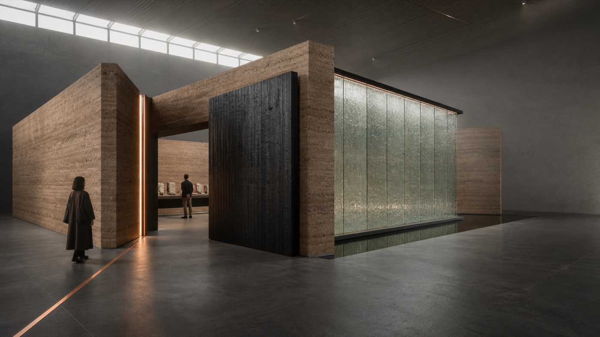<br><sub>把图形/编辑风格胶囊迁移到建筑空间，没有复制原主体、文字、网格或精确版式坐标。<a href="examples/architecture-exhibition.json">查看规格</a></sub></td>
  </tr>
  <tr>
    <td width="50%" valign="top"><strong>暗场人物与材质写实</strong><br><br><sub>仅人工视觉复核：自然皮肤、靛蓝布料、旧木材、拉丝黄铜、选择性微纹理和干净暗部；原始提示记录未保留，因此不作为 manifest 绑定证据。</sub></td>
    <td width="50%" valign="top"><strong>科研参考图重建</strong><br>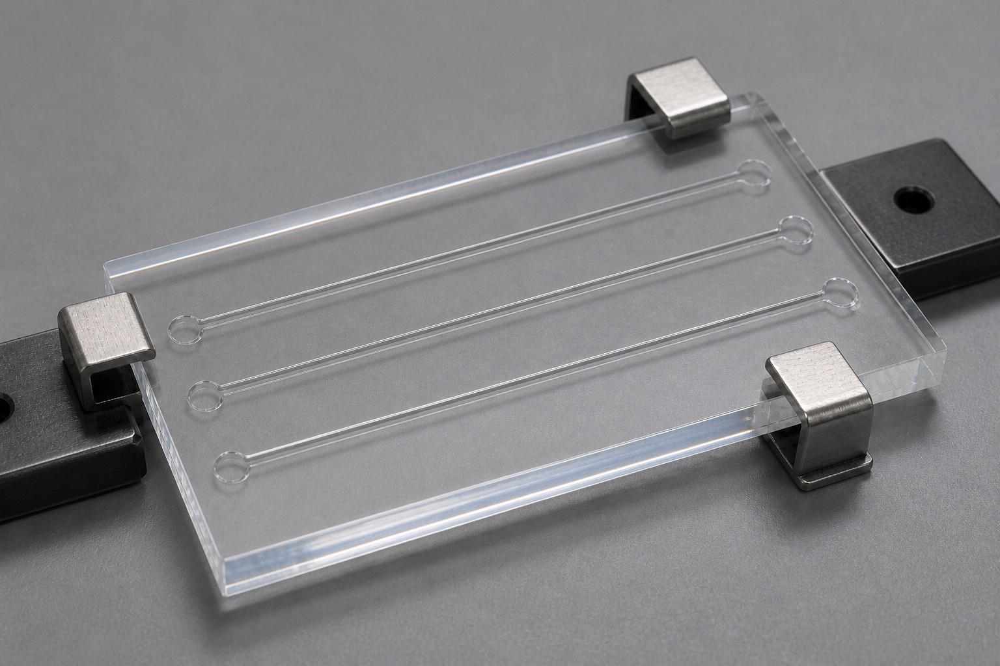<br><sub>把可观察的几何、数量、材质、机位和光线与推测、未知项分开；真实原图与回执均绑定证据。<a href="tests/forward-specs/reconstruct-microfluidic-chip.json">查看规格</a></sub></td>
  </tr>
</table>

## 为什么使用镜造？

- **统一视觉事实源：** 场景、人物、镜头、灯光、材质、文字、修改、保留项和排除项集中维护。
- **按任务控制干预强度：** 中立模板不输出画幅、机位、坐标、颗粒、bloom、flare、粒子、调色或渲染预设；用户明确要求的专业控制完整保留。
- **有意识地利用模型世界知识：** 可选 `knowledge_anchors` 保留精确的人物、地点、事件、器物和世界观专名。
- **控制局部修改：** 使用归一化坐标、区域、“只修改”指令和明确保留列表。
- **控制常见画面伪影：** 用紧凑质量档管理噪点、光斑、bloom、油蜡感、锐化光环和装饰性粒子。
- **自动判断视觉意图：** 区分剧情电影帧、key art、海报、真实电影、艺术化电影、图形化风格、巨物奇观和题材世界规则。
- **20+ 使用场景自动路由：** 剧情、肖像、表演、动作、广告、品牌、产品、时尚、美食、建筑、环境、载具、怪物、历史、科研、图解、界面、游戏、活动、社交和实验艺术。
- **一致的风格系统：** 支持电影自然主义、黑色电影、表现主义、超现实梦境、浪漫崇高、现代主义图形、复古胶片、奢华编辑、手工触感、绘画、动画、纪实、世界构建、极简、档案与混合媒介。
- **从参考图学习风格：** 把实际像素中的可复用机制沉淀为不含原图的 `style_capsule`，强制填写迁移边界，并对引号文案、品牌/签名词和坐标做风险提醒。
- **把真实参考图直接交给 ImageGen：** 用户提供的人物、服装、产品、Logo、道具、场景、机位或风格图片会进入必传附件清单，不允许被文字描述偷偷替代。
- **区分管线成功与创意质量：** 附件送达不等于成片通过；还必须检查用途、产品使用、交互物理、人体结构、重心和观众结论。
- **清理污染但不削弱风格：** 用来源追踪和语义台账删除旧错误残留、否定联想、机制重复与冲突锚点，同时保护媒介、审美、调色、材质、镜头和有意夸张。
- **设计画面张力与漂亮镜头：** 控制主次阅读、动作/反作用力、前中后景职责、夸张、镜头投影、畸变、视差、裁切压力和运动证据。
- **建立专业调色管线：** 曝光、曲线、黑白位、高光滚降、色彩分离、肤色保护、胶片颗粒、halation、bloom 与跨镜匹配。
- **描述专业 CG 渲染：** Blender Cycles、Unreal Engine 5/Lumen、路径追踪、光线追踪、全局光照、PBR/NPR 材质、体积、采样、降噪，以及单次生成图里的可见 pass 分离。
- **联动人物与摄影：** 人物调度、眼线、轴线、观众位置、景别、机位高度、距离、焦段、焦点和实景光源共同服从一个观看任务。
- **参考图分镜板：** 参考职责分离、单格镜头卡、3×3 装配，以及线稿、手绘稿和真实电影帧三种质感。
- **不伪造平台参数：** 旧版 `weight / lock / variance` 仅为兼容保留；新模板和示例不再使用，编译器忽略它们，也绝不映射为平台控制。
- **从真实使用中优化：** 发现可复用问题时先提出证据和策略，经用户同意并回归测试后才修改 Skill。

## 支持的工作模式

| 模式 | 适用场景 |
| --- | --- |
| `create` | 从简洁单主体到复杂场景的新图创建 |
| `reconstruct` | 基于实际参考图，区分可观察特征与未验证推测 |
| `edit` | 带明确保留约束的最小局部修改 |
| `restyle` | 锁定身份、姿势、几何、版式和文字，只改变视觉处理 |
| `expand` | 按保留合同扩展画布；极端扩图中的位置、尺度与比例必须视觉复核，可能失败 |
| `learn_style` | 读取参考图，提取可迁移视觉规律并验证可复用风格胶囊 |
| `styleboard` | 把人物、服装、场景、机位和风格参考转译为一致的多镜头展示板 |

## 30 秒安装

把仓库克隆到当前用户的 Codex Skills 目录：

```bash
git clone https://github.com/papperrollinggery/jingzao-image-forge.git ~/.codex/skills/jingzao-image-forge
```

新建一个 Codex 任务，然后显式调用：

```text
$jingzao-image-forge 根据这份需求创建 21:9 电影级关键视觉，
输出通过校验的 visual_generation_spec 和 GPT Image 2 提示词。
```

当任务明显需要结构化图片提示词时，也允许自动发现。

## 使用示例

### 创建

```text
$jingzao-image-forge 创建一个红色陶瓷杯的棚拍产品图，
浅灰背景，1:1，不要文字，编译为 FLUX 提示词。
```

### 利用命名实体与世界知识

```text
$jingzao-image-forge 把精确人物名和指定版本作为 knowledge anchor，
保持原动画媒介；“电影感”只指构图、规模和灯光，不转换成真人实拍。
目标平台：GPT Image 2。
```

### 局部修改

```text
$jingzao-image-forge 把 (x:16.5%, y:16.4%) 附近的月球改成物理破碎状态。
只修改月球，保持机位、城市轮廓、曝光、调色、氛围和周围天空不变。
```

### 扩图

```text
$jingzao-image-forge 把横版图片扩展为 21:9。
灯塔的相对位置和大小不变，左右增加可供后续裁切的安全留白。
```

### 电影剧情型镜头

```text
$jingzao-image-forge 创建一张电影剧情剧照，不要做成海报。
先分析人物关系变化和观众任务，再自动匹配调度、机位、距离、
焦段、焦点和有来源的光线。
```

### 参考图九宫格分镜

```text
$jingzao-image-forge 使用这些人物、服装、场景、机位和手绘风格参考，
建立 3×3 九宫格分镜。每张参考只承担一个职责，再根据速度和连续性风险，
自动选择一键整板、逐格生成或混合策略。
```

### 从参考图学习可复用风格

```text
$jingzao-image-forge 实际检查这张参考图，创建一个候选 style capsule。
把观察、推断和未知分开；迁移色彩、线条、材质、灯光、层级和渲染规律，
不要迁移原图人物、身份、文字、Logo 或精确版式。用两个新题材做验证。
```

## 工作流程

```text
图片需求 / 参考图观察 / 修改意图
                ↓
  场景 + 题材 + 审美 + 制作媒介路由
                ↓
      visual_generation_spec
                ↓
  确定性规格校验 + 可选 style_capsule
                ↓
OpenAI · FLUX · Midjourney · generic 提示词
```

简单需求可以直接交付精简提示词；多人物、精确版式、参考图或编辑任务则使用完整规格。

## 多图参考会真正传给模型

用户提供真实资产时，镜造只记录图片来源、职责和 `must_attach`。编译结果会返回 `attachments`、`reference_handoff` 与目标感知的 `imagegen_call_plan`。内置 ImageGen 遇到超过五张必传图、本地/会话机制混用、未解析远程/平台资产或未经确认的最近会话图窗口时会 fail closed；工具执行后，receipt 必须与预期图片 ID、数量和机制一致，才可称为参考图驱动结果。

人物身份、服装标记、产品、包装、Logo、道具、场景、构图和风格参考都适用。GPT Image 2 支持一张或多张参考图，并自动以高保真处理所有图片输入。Logo、产品和人物保真仍需检查实际结果；失败时定向重试或使用模型自身的图片编辑路径。镜造不执行生成后合成。

验证器会拒绝没有至少一张必传图片的 `reconstruct`、`edit`、`restyle`、`expand` 和 `learn_style` 规格。原子编辑示例因此使用显式运行时资产占位符；真正执行前必须换成实际原图。

```bash
python3 scripts/reference_delivery.py path/to/spec.json --target codex_imagegen
python3 scripts/reference_delivery.py path/to/spec.json --target codex_imagegen --receipt path/to/receipt.json
```

详见[真实多图参考交接](references/reference-delivery.md)。

## 自动视觉导演矩阵

镜造会把经常被混成“电影感”的内容拆开判断：

| 维度 | 可选值 |
| --- | --- |
| 使用场景 | 剧情、商业、空间、知识、界面、游戏、社交与实验等 20+ 路径 |
| 题材家族 | 剧情 · 恐怖 · 黑色 · 动作 · 奇幻 · 科幻 · 历史 · 纪实 · 商业 · 超现实 · 自定义 |
| 审美家族 | 自然主义 · 黑色光影 · 表现主义 · 梦境 · 崇高 · 现代图形 · 胶片 · 编辑 · 手工 · 绘画 · 动画 · 纪实 · 世界构建 · 极简 · 档案 · 混合 |
| 制作媒介 | 摄影 · 实拍电影 · CG · 风格化 3D · 2D · 插画 · 水墨 · 水彩 · 油画 · 版画 · 拼贴 · 停格 · 微缩 · 纸艺 · 档案 · 界面 · 混合媒介 |
| 场景原型 | 最多三个开放式空间功能，如亲密室内、公共建筑、棚拍台面、荒野、舞台、实验室、水下、太空或微缩布景 |
| 调性权威 | 用户需求 · 原图参考 · 风格胶囊 · 原图匹配；明确 tone locks 在换题材时仍保留 |
| 空间张力 | 主次阅读 · 漂亮机制 · 张力 · 动作/反作用力 · 景层职责 · 夸张 · 畸变 · 运动证据 |
| 调色管线 | 数字中性 · 电影调色 · 胶片/印片 · 银漂 · 黑白 · 交叉冲洗 · 档案 · 自定义 |
| 渲染管线 | 离线 PBR · 实时 · 路径追踪 · 光栅 · NPR · 单图混合分层 · 自定义 |
| 交付类型 | 电影剧情帧 · 电影 key art · 海报 · 概念设计 |
| 处理方式 | 真实电影 · 艺术化电影 · 图形化风格 |
| 奇观尺度 | 亲密 · 戏剧 · 巨物 · 神话级 |
| 摄影自由度 | 物理可拍 · 强化但可解释 · 有意不可能 |
| 题材逻辑 | 中国玄幻、修仙、神话、巨物、科幻、纪实等用户定义规则 |

剧情帧先确定一个可见事件、人物关系压力、观众任务和冻结瞬间；海报可以同时展示主要资产。巨物与神话级画面必须通过人/环境尺度对照、空气透视、遮挡、视差、阴影范围和环境反应证明规模。中国玄幻特效必须具备来源、启动规则、空间作用、阻力或代价、结果和残留。

## 场景与风格图谱

镜造不会把所有需求都当成电影海报。产品图优先检查轮廓、接触、标签与材质；时尚图检查服装轮廓、姿态、皮肤/头发与造型密度；建筑图检查体量、流线、人物尺度、采光与材料节点；科研和信息图检查事实结构、精确标签与阅读顺序；实验艺术必须有明确的变换规则。

题材、审美和制作媒介彼此独立。恐怖可以是真实电影、表现主义、档案、手工或图形化；科幻可以是纪实、奢华编辑、生态未来、制度压迫或轻快动画。一个主审美负责全局层级，一个辅助影响只能通过 `mix_rule` 控制指定层。详见[使用场景档案](references/scenario-profiles.md)和[视觉风格图谱](references/visual-style-atlas.md)。

## 镜头张力、专业调色与 CG 渲染

电影、战斗、表演、时尚运动和奇观画面会先定义观众第一眼看什么、张力从哪里来、动作与反作用力如何传递、每个景层承担什么，以及允许多大程度的夸张。机位俯仰/偏航/翻滚、镜头投影、透视畸变、边缘行为、视差、裁切压力和相机状态都必须服从动作可读性。详见[镜头张力设计](references/shot-tension-design.md)。

专业调色不是一个 LUT 名称。镜造会分开描述技术/显示意图、曝光、色调曲线、黑白位、高光滚降、暗部底线、中间调密度、色彩分离、肤色保护、饱和度/色域、胶片负片/印片特征、颗粒、halation、bloom、gate weave、暗角与跨镜匹配。详见[专业调色管线](references/color-pipeline.md)。

CG 任务中，引擎名称属于受控参考。“Blender Cycles”可表达路径追踪与材质/光线传输；“Unreal Engine 5 Lumen”可表达动态漫反射互反射、粗糙度相关反射、天空遮蔽和实时电影约束。除非真实引擎流程在范围内，否则不会声称实际运行了这些软件。详见[渲染管线词汇](references/render-pipeline.md)。

## 电影超宽画幅预设

通用模板现在保持画幅中立：`canvas.profile` 与 `aspect_ratio` 默认为 `auto`，只有用户要求、原图比例、交付格式或构图理由成立时才选择具体画幅。需要横向关系、画外空间、巨物尺度或 21:9/2.35:1 交付时，使用 `cinematic_ultrawide`：

```json
{
  "canvas": {
    "profile": "cinematic_ultrawide",
    "aspect_ratio": "21:9",
    "dimensions": {"width": 1792, "height": 768}
  }
}
```

不会把所有电影镜头强制改成超宽画幅。

显式 `2.35:1` 与 `2.39:1` 需求也受支持；只有横向关系、画外空间、地理层级或交付规格需要时才使用。

## 分镜板与九宫格模式

`styleboard` 支持 `line_art` 黑白线稿、`hand_drawn` 手绘灰阶、`cinematic_frame` 真实/指定媒介电影帧，以及混合展示。每张参考图只承担人物、服装、场景、道具、机位动作、风格、版式或色彩中的一个主要职责。

九宫格提供三种执行策略：`sheet_direct` 一键生成整张，速度最快；`independent_frames` 逐格生成，适合严格身份与机位连续性；`hybrid` 先快速出整板，再只重做入选或失败格。`auto` 根据速度需求和连续性风险自动选择。

## 从参考图学习风格

`learn_style` 会实际读取参考图，把直接可见机制与生产推断、未知细节分开，随后导出可复用的 `style_capsule`。胶囊可以保存媒介行为、色彩归属、线条/形状、纹理/材质、灯光、构图、字体、光学/渲染、迁移规则与禁止迁移项。

这不是模型微调。导出器会移除输入记录、不保存原图像素、要求明确的禁止迁移规则，并对疑似精确文案、品牌/签名或坐标的视觉规则发出提醒；这些检查是辅助性的，人物身份、受保护角色、品牌、文案、签名和版式排除仍需人工复核。标记为 `validated` 或 `adopted` 前，必须经过两个不同题材的 forward test、视觉复核，并绑定到不含原始私图的证据清单；写入全局安装或公开仓库前需要明确授权。

```bash
python3 scripts/validate_spec.py examples/style-learning-graphite-copper.json
python3 scripts/create_style_capsule.py examples/style-learning-graphite-copper.json \
  --output /tmp/style-capsule-graphite-copper.json
python3 scripts/validate_style_capsule.py /tmp/style-capsule-graphite-copper.json
python3 scripts/compile_prompt.py examples/tactile-stop-motion-product.json \
  --style-capsule /tmp/style-capsule-graphite-copper.json \
  --platform openai
```

## 视觉规格与可选知识锚点

下方 JSON 是跨平台编译使用的可维护视觉事实源。`knowledge_anchors` 不是必填项；出现可被模型识别的专名，或用户提供匹配参考图时才启用：

```json
{
  "knowledge_anchors": [
    {
      "name": "Bethel, New York on August 16, 1969",
      "context": "period-accurate Woodstock-era scene",
      "strategy": "auto",
      "reference_ids": [],
      "verification": "unverified"
    }
  ]
}
```

- `auto`：无参考图时利用模型知识；有匹配参考图时自动采用混合方式。
- `model_knowledge`：保留精确实体名，让具备相关知识的模型优先理解。
- `reference`：以用户提供的参考图约束标准形象。
- `hybrid`：结合精确实体名和版本匹配的参考图。

世界知识只是创作依据，不是准确性证明。没有可信参考图或用户确认时，标准形象应保持 `unverified`。

## 平台编译

| 目标平台 | 处理方式 |
| --- | --- |
| OpenAI GPT Image 2 | 专名锚点前置；提示词与 `model / quality / size` 分离；保留编辑不变量 |
| FLUX.2 | 支持自然语言或结构化 JSON；不虚构 negative prompt 通道 |
| Midjourney | 先写画面内容，参数统一置于末尾；坐标仍是语义锚点 |
| Generic | 输出可移植 prompt、negative prompt、参数和平台警告 |

```bash
python3 scripts/validate_spec.py examples/atomic-cyber-live-action.json
python3 scripts/validate_spec.py examples/narrative-film-frame.json
python3 scripts/validate_spec.py examples/styleboard-3x3.json
python3 scripts/validate_spec.py examples/style-learning-graphite-copper.json
python3 scripts/validate_style_capsule.py examples/style-capsule-graphite-copper.json
python3 scripts/validate_spec.py examples/causal-fantasy-effect.json
python3 scripts/compile_prompt.py examples/atomic-cyber-live-action.json --platform openai
python3 scripts/compile_prompt.py examples/atomic-cyber-live-action.json --platform flux
python3 scripts/compile_prompt.py examples/atomic-cyber-live-action.json --platform midjourney
python3 scripts/compile_prompt.py examples/atomic-cyber-live-action.json --platform generic
```

验证器和编译器要求 Python 3.10+，运行时仅依赖标准库。

## 伪影与材质质量控制

镜造使用一个可选的 `render.artifact_budget`，不把所有清理词堆进每条提示词：

| 质量档 | 适用场景 |
| --- | --- |
| `auto` | 中立首轮，不输出清理预设或审美预设 |
| `strict` | 产品图、精确文字、图表、极简编辑设计和干净渐变 |
| `balanced` | 明确需要克制高级收尾时，只允许由场景驱动的效果 |
| `expressive` | 绘画、胶片、幻想或重 VFX 画面，允许有意的媒介伪影 |
| `source_matched` | 需要继承原图颗粒、光斑、锐度和表面响应的编辑与扩图 |

质量层会分别管理材质粗糙度、高光、纹理尺度、焦点细节、噪声/颗粒、bloom、flare、粒子与锐度。用户明确要求的胶片颗粒、笔触、湿润高光或实际光源 flare 会被保留；无来源噪点、全局油亮和全画面同等锐利不会被当作“高级感”。详见[伪影与材质质量控制](references/quality-controls.md)。

## 目录结构

```text
.
├── SKILL.md                     Codex Skill 入口
├── agents/openai.yaml           界面信息与调用策略
├── templates/                   视觉规格与风格胶囊模板
├── references/                  场景、风格、镜头、调色、渲染、学习、规格与平台编译说明
├── scripts/                     规格/胶囊验证器、附件预检、胶囊导出器与提示词编译器
├── examples/                    电影、动作/VFX、分镜、风格学习、产品和建筑验证示例
├── tests/                       回归测试与行为评测
└── assets/                      README 视觉素材
```

## 验证

```bash
python3 -m py_compile scripts/validate_spec.py scripts/validate_style_capsule.py scripts/create_style_capsule.py scripts/compile_prompt.py scripts/reference_delivery.py scripts/prompt_lint.py scripts/validate_forward_tests.py tests/test_skill.py
uvx ruff check scripts tests
python3 scripts/validate_spec.py templates/visual-spec.json
python3 scripts/validate_spec.py examples/atomic-cyber-live-action.json
python3 scripts/validate_forward_tests.py tests/forward-test-manifest.json
python3 scripts/prompt_lint.py examples/causal-fantasy-effect.json --platform openai --approve-review --max-words 1800
python3 -m unittest discover -s tests -v
```

当前本机基线为 **151 项确定性回归测试**，覆盖七种模式的 schema/编译结构、中立模板、低干预以及自然语言/FLUX JSON 空提示 fail-closed 行为、十二份经验证的 forward 规格或示例、两份证据绑定风格胶囊、ImageGen 目标预检与 receipt、递归公共回执脱敏与仓库路径约束、manifest/case/prompt-source 白名单、已提交输出哈希、可执行提示复核、四平台结构化精确文案豁免污染 lint、显式专业字段不删除投影、模板占位词泄漏、画布与平台参数一致性、场景路由、调色/渲染结构、空间张力、因果 VFX、Midjourney 执行路由、胶囊导出、异常输入和 CLI 合同。实际生图质量仍由[证据清单](tests/forward-test-manifest.json)中的人工 forward test 验收，不伪装成像素 CI。

人工视觉复核：使用暗场环境人像同时测试自然皮肤、靛蓝布料、拉丝黄铜、旧木材和单一实用灯具。实际产图的材质分离、暗部可读性、焦点细节和受光源驱动的高光均通过；未发现失控噪点、漂浮光球、全局油蜡感、锐化光环或合成 bokeh。该图保留在案例区，但原始提示记录未保留，因此不作为 manifest 绑定证据。

新增导演能力输出通过视觉复核：渡口兄妹关系镜头呈现为有动机的电影剧照而非海报；中国玄幻巨物镜头通过建筑、水压、遮挡和单一因果法阵证明尺度；`sheet_direct` 一键 3×3 手绘分镜得到九张可读单格。前两项已绑定 manifest；九宫格原始参考图交付回执未保留，明确标为仅人工复核。

风格学习 forward test 也已通过：同一个石墨黑/铜金胶囊分别迁移到方形手工茶罐产品图和宽画幅建筑展亭。两张图都保留了色彩归属、材质层级、干净暗部、克制铜色和可读留白，同时更换了主体、比例、空间和制作媒介；均未复制原图标题、人物、门户、九宫格或版式坐标。通过输出已公开并与证据清单绑定，其他候选继续忽略。

新增独立模式实测保持严格：`restyle`、科研 `reconstruct` 和动态 CG 创建通过并进入案例区。`expand` 虽然环境连续，但无法同时守住目标比例、横向锚点和原始画面高度比例，因此明确记录为当前限制，不进入案例。另一项五参考图压力测试只证明五张原图均已送达，却没有通过创意用途和手—物交互验收，同样排除。附件管线与成片质量是两道独立门禁。

取消静默字段删除后，当前玄幻与 CG 时尚的编译投影分别为 1726 与 2603 词，均保持 `review_required`：词数预算只是复核触发器，不是模型最佳长度或自动截断规则。现有图片属于早期执行的视觉证据；两张均未使用当前投影重新生成。

随后用受控交接实验定位上游提示问题：保持同样五张参考和同一动作，只把 2253 词的跨区段提示改为简洁的当前画面说明，原先无底部承托的侧捏问题就消失；把动作改为有明确用途的静止柜台交付后，画面意义与重心继续改善；只保留三张必要参考时交互最干净。由于每组只有一次样本，这支持优化方向，不宣称普遍概率。实际修复是语义归属与污染审查，不是强制写实或一刀切缩短提示。详见[不削弱风格的提示清洗](references/prompt-hygiene.md)。

已采用的 **Crimson Nocturne Wuxia Print Montage / 绯夜武侠胶片拼贴** 胶囊来自三张用户参考图，但不保存原图。它又在两个无关题材上完成 forward test：现代爵士歌手与沙漠科幻信使；两次都保留绯红/青蓝色彩归属、主导肖像与微型叙事层级、克制双重曝光和不均匀旧印刷质感，同时没有复制原人物、服装、文字、签名、水印或精确版式。详见[内置风格胶囊](references/style-capsules.md)。原始私图不公开，通过的跨题材输出作为证据公开。

同模型质量对比使用简单提示词、专业电影/产品路线和镜造分别完成动作与产品任务，记录可见优势、退化点和“虚构标签文字”修复重试，不宣称存在跨任务的绝对赢家。详见[对比结果](tests/benchmark-results.md)。

## 设计方法与研究依据

镜造为独立实现，但发布结构和质量方法对照了以下高质量一手资料：

- [OpenAI GPT Image 生图提示指南](https://developers.openai.com/cookbook/examples/multimodal/image-gen-models-prompting-guide)：结构化提示、真实皮肤与材质、自然色彩、克制修饰、世界知识和逐次迭代。
- [OpenAI Plugins](https://github.com/openai/plugins)：当前 Codex 插件与 Skill 的组织方式。
- [Anthropic Skills](https://github.com/anthropics/skills)：清楚的能力定义、自包含结构、安装、示例和限制。
- [GPT-Image2-Skill](https://github.com/wuyoscar/GPT-Image2-Skill)：参考图库路由、分类提示方法、精确文字以及材质/灯光/色彩分离。
- [Superpowers](https://github.com/obra/superpowers)：证据优先、回归测试、行为评测和明确能力边界。
- [ARRI 摄影案例](https://www.arri.com/news-en/alexa-lf-signature-primes-and-skypanels-on-the-film-rrr)：焦段、运镜、尺度和机位根据镜头任务选择，而非通用电影感词汇。
- [Pixar RenderMan 摄影研究](https://renderman.pixar.com/stories/incredible-cinematography)：摄影、调度和灯光随着人物和段落强度变化，同时保持统一视觉语言。
- [Cinematic Storyboard Generator](https://github.com/NBchitu/cinematic-storyboard-generator)：公开九宫格、风格母版和逐镜提示结构；镜造把一键整板作为速度路径，把逐格生成作为精度路径。
- [OpenAI Academy：使用 ChatGPT 创建图片](https://openai.com/academy/image-generation/)：目标优先提示、明确不变量、单次小改、参考职责、精确文字和密集版式建议。
- [Midjourney Style Reference](https://docs.midjourney.com/hc/en-us/articles/32180011136653-Style-Reference)：当前 `--sref`、全局 `--sw` 与多图正相对权重 `URL::weight` 语法。
- [OpenAI 图片生成指南](https://developers.openai.com/api/docs/guides/image-generation)：一张或多张参考图、GPT Image 2 高保真输入、图片编辑、灵活尺寸和模型限制。
- [Unreal Engine：什么是虚拟制片](https://www.unrealengine.com/explainers/virtual-production/what-is-virtual-production)：把预演、提案可视化、技术预演、动作预演、虚拟勘景、实时合成和机内 VFX 区分为不同场景。
- [Pixar RenderMan：Cinematography with Soul](https://renderman.pixar.com/stories/cinematography-with-soul)：触感世界、真实光线、预打光和从粗到细协作。
- [SideFX：World Building](https://www.sidefx.com/products/houdini/world-building/)：可指导的地形、植被、云、海洋、模拟与程序化环境系统。
- [加拿大国家电影局：Stop-Motion](https://blog.nfb.ca/blog/2018/08/13/animation-stop-motion/)：逐帧物体拍摄、黏土/真人逐格/混合技法与实体动画工艺。
- [GPT-Image2-Skill Gallery Atlas](https://github.com/wuyoscar/GPT-Image2-Skill/blob/main/skills/gpt-image/references/gallery.md)：摄影、产品、美食、时尚、建筑、科研、UI、插画、电影、字体与编辑的分类索引和按需加载结构。
- [ARRI Image Science 与 Look Files](https://www.arri.com/en/learn-help/learn-help-camera-system/image-science/look-files)：Log 记录、技术显示转换、创意 look 管理、曝光宽容度和电影式高光处理。
- [ACES Output Transforms](https://docs.acescentral.com/system-components/output-transforms/)：场景参照色彩、渲染变换、色域/色调映射、显示编码和观看条件。
- [DaVinci Resolve Film Look Creator](https://documents.blackmagicdesign.com/SupportNotes/DaVinci_Resolve_19_1_New_Features_Guide.pdf)：halation 强度、半径、饱和度、高光阈值等胶片完成度控制。
- [Blender Cycles 与 Principled BSDF](https://docs.blender.org/manual/en/4.0/render/shader_nodes/shader/principled.html)：金属、漫反射、次表面、透射、coat、sheen、emission、粗糙度与 IOR 等物理材质行为。
- [Unreal Engine 5 Lumen](https://dev.epicgames.com/documentation/en-us/unreal-engine/lumen-global-illumination-and-reflections-in-unreal-engine)：动态漫反射互反射、间接镜面、天空遮蔽、发光反弹、半透明与粗糙度相关反射。

最终方法保持克制：先锁定精确意图，只在有价值时启用结构化控制；确定性校验；每次只使用一个伪影质量档；定向迭代；未检查实际产图前不宣称质量通过。

## 能力边界

- Skill 负责规格和提示词，不直接生成图片；实际出图可配合 Codex `$imagegen` 或其他图片生成系统。
- 坐标是语义锚点，不等于像素级蒙版。
- 逆向分析只能描述可观察特征，不能恢复未知的原始提示词。
- 风格学习提取可观察的视觉机制，不等于训练权重、恢复隐藏提示词或获得公开私人参考图的权限。
- 风格胶囊始终服从目标需求，经过实际迁移验证后才能标记为已验证或采用。
- 必需参考图必须真实出现在生成/编辑工具调用中；编译提示词里的图片描述不能证明附件已传入。
- 参考驱动生成仍需实际视觉复核；本 Skill 不引入生成后合成步骤。
- 引擎名称默认只是外观参考；除非真实渲染流程明确在范围内，提示词不能证明软件已经执行。
- 胶片模拟和专业调色仍是视觉意图，生成结果必须在真实观看条件下复核。
- 修改模型、参数、限制或平台能力前，应重新核对官方文档。
- 编译成功不代表画面质量、角色准确性或平台兼容性已经验证，必须检查实际产图。

## 常见问题

### 镜造 Image Forge 是什么？

它是一个把图片需求转换成结构化视觉规格和多平台提示词的 Codex Skill。

### 为什么不用一段很长的提示词？

结构化规格能把稳定事实、保留约束和允许变化分离，使关系、文字、局部修改和平台差异更容易维护与测试。

### 能利用 GPT Image 2 的世界知识吗？

可以。精确命名实体可作为可选知识锚点，并在 OpenAI 提示词前部保留；最终准确性仍需视觉检查。

### 能进行像素级局部修改吗？

规格可以描述点位和近似区域。像素级边界仍需要真实蒙版或平台编辑区域能力。

### 是否绑定某个图片模型？

不绑定。视觉规格保持平台中立，目前支持 OpenAI、FLUX、Midjourney 和 generic 编译。

### 如何避免电影镜头变成海报？

剧情型配置必须写清事件、关系压力、观众任务、冻结瞬间、人物调度、机位动机、焦段理由和光线动机，并禁止把所有角色、道具和特效同时英雄化展示。

### 支持九宫格分镜吗？

支持。`styleboard` 提供 3×3 版式、参考职责分离、连续性锁定、一键整板、逐格独立生成与混合替换，以及线稿、手绘稿、真实电影帧或混合质感。

### 可以从我的参考图学习风格吗？

可以。`learn_style` 会实际读取图片，区分观察与推断，导出不含原图的风格胶囊，对明显的内容复制风险做提醒，再用不同内容验证。人物、品牌、受保护元素和精确版式是否被排除，仍由迁移规则与人工复核共同保证。

### ImageGen 会收到我给的产品、Logo 或人物原图吗？

会，只要图片已提供并标记 `must_attach`。编译器会输出附件清单，执行流程把实际图片传给 ImageGen，而不是只转成文字。生成后检查人物身份、服装标记、包装、Logo 形状、位置、拼写与颜色；失败就在生成/编辑路径内定向重试，不用合成掩盖。

### 能处理哪些图片场景？

除了电影和奇幻，还包括肖像、人物关系与表演、动作、广告、品牌系统、产品、时尚、美妆、美食、建筑、环境、载具、怪物、历史纪实、科研教育、信息图、界面、游戏资产、活动、社交内容和实验艺术。

### 支持 Blender 或 Unreal Engine 风格的渲染吗？

可以描述 Blender Cycles、Eevee、Unreal Engine 5/Lumen 及其他专业渲染器对应的材质、光线传输、GI、反射、体积、采样和单次生成图里的 pass 分离。除非用户真的运行渲染器，否则它是外观规格，不是执行回执；它不会引入生成后合成路径。

### 支持专业电影调色和胶片颗粒吗？

支持。`color_pipeline` 管理曝光、色调密度、高光滚降、色彩分离、肤色保护、显示意图、负片/印片特征、颗粒、halation、bloom、gate weave、暗角和跨镜匹配；有意胶片质感与 AI 噪点、油腻感分开管理。

## 项目状态

项目会根据真实使用中发现的问题持续改进，并在同步安装副本前运行结构校验、规格验证、回归测试和平台编译验收。

欢迎提交聚焦问题的 issue；在维护者选择许可证前，重新分发与代码贡献条款尚未确定。

本项目为独立社区项目，与 OpenAI、Black Forest Labs、Midjourney、Anthropic 及其产品无隶属关系。
